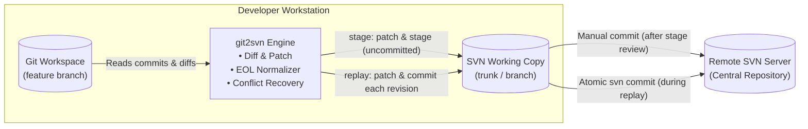

# Git-to-SVN Synchronization CLI (`git2svn`)

<p align="center">
  <a href="https://github.com/simon123h/git2svn/actions/workflows/ci.yml"></a>
  <a href="https://codecov.io/gh/simon123h/git2svn"></a>
  <a href="https://pypi.org/project/git2svn/"></a>
  
  
  <a href="https://github.com/simon123h/git2svn/releases"></a>
  <a href="LICENSE.md"></a>
</p>

A lightweight, zero-dependency Python 3 CLI utility to bridge local Git development workspaces with a Subversion (SVN) repository. It provides two symmetrical, intuitive commands to either stage changes for manual review (`stage`) or sequentially commit them into SVN history (`replay`).

---

## What `git2svn` Is (and What It Is Not)

> [!IMPORTANT]
> **Subversion is the primary source of truth.**
> `git2svn` is designed for teams whose authoritative central repository is Subversion, but whose developers prefer the agility, local branching, rebasing, and tooling of Git.

### ✅ What `git2svn` is designed for:
- **Complementing an existing `svn2git` mirror:** You have an automated or incremental SVN-to-Git mirror (e.g. via `all-fast-export`, `subgit`, or an internal sync job) pulling SVN revisions into a tracking branch (such as `origin/svn-mirror/trunk` or `mirror/trunk`). `git2svn` serves as the **reverse gateway**, letting you replay your local feature branches cleanly back into SVN.
- **Local Git freedom with an SVN backend:** Work locally with Git branches, stashes, and interactive rebases, then ship clean changesets to SVN with zero manual copy-pasting.
- **Safe, staged inspection (`stage`):** Reviewing complex diffs or running pre-commit checks in TortoiseSVN before changes touch the SVN server.
- **Sequential commit porting (`replay`):** Porting multi-commit PRs into SVN with original commit messages and conflict pause-and-resume control.

### ❌ What `git2svn` is NOT designed for:
- **It is NOT an autonomous full-mirror / bidirectional replication tool:** `git2svn` does not automatically track arbitrary Git tags, merge trees, or multi-branch mappings across repositories. Git history should be strictly linear before replaying to SVN.
- **It is NOT intended for Git-as-master workflows:** If Git is your authoritative source of truth and you merely want to mirror everything into a passive SVN replica without human interaction, use a dedicated continuous migration daemon like SubGit.

---

## Key Highlights

- **Zero External Dependencies:** Built purely on Python 3 standard library and standard `git`/`svn` CLI tools.
- **Smart CRLF/LF Normalization:** Automatically reconciles line endings post-patch, preventing Subversion `E135000: Inconsistent line ending style` commit failures.
- **Clean Intent Model:**
  - `stage`: **Never commits.** Staged in SVN (`svn add`, `svn rm`) for inspection in TortoiseSVN or CLI before manual commit.
  - `replay`: **Always commits.** Sequentially ports Git commits into SVN with original author messages and a stateful conflict recovery lifecycle.
- **Flexible Reference Syntax:** Accepts single commits (`abc1234`), range notation (`main..feature`), or two positional arguments (`main feature`).
- **Binary & Snapshot Support:** Direct object DB extraction (`--copy`) for binary assets and whole-tree alignment (`--snapshot`).

---

## Quick Start

### Installation

Install via `pipx` (recommended) or `pip`:

```bash
# Using pipx (isolated global CLI command):
pipx install git2svn

# Or via standard pip:
pip install git2svn
```

Alternatively, run directly from source without installing:

```bash
git clone https://github.com/simon123h/git2svn.git
cd git2svn
python3 -m git2svn --help
```

### Workflow & Basic Commands

`git2svn` is designed so you **bootstrap once** with `setup`, after which all synchronization commands run cleanly without needing `--svn-dir` or `--svn-url`:

```bash
# 1. Bootstrap once in your Git repository (URL or local path)
#    This automatically checks out a managed SVN copy into .git/git2svn/svn_wc,
#    detects mirror tracking branches, installs a pre-push guard against accidental pushes,
#    and configures convenient git aliases.
git2svn setup https://svn.example.com/repo/trunk
# (or with an existing local checkout: git2svn setup /path/to/svn)

# 2. Check synchronization health and pending commits
git2svn status

# 3. Stage a single commit or squash an entire branch (uncommitted for review)
git2svn stage a1b2c3d4
git2svn stage main..feature/login --diff

# 4. Preview uncommitted staged changes in SVN
git2svn diff
git2svn diff --stat

# 5. Replay an entire feature branch commit-by-commit into SVN history
git2svn replay main..feature/login

# 6. Resume replay after resolving conflicts
git2svn replay --continue

# 7. Discard staged changes, remove conflict artifacts, or purge managed workspace
git2svn clean
git2svn clean --purge

# 8. Run pre-flight environment & configuration diagnostics (or auto-remediation)
git2svn doctor          # or: git2svn doctor --fix

# 9. Enable shell tab-completion (bash, zsh, fish)
eval "$(git2svn completion bash)"   # or: git2svn completion --install

# 10. Or use the built-in Git aliases created during setup:
git svn-push     # Replay trunk commits to SVN and fetch mirror
git svn-pull     # Pull fresh SVN mirror commits & rebase local trunk
git svn-status   # Run git2svn status
```

*(Note: Advanced users or CI/CD scripts can still pass `--svn-dir <path>` or `--svn-url <url>` to override the configured workspace on any command).*

---

## Architecture at a Glance



---

## Documentation

Comprehensive documentation-as-code is maintained in the [`docs/`](docs/) folder:

- **[User Guide](docs/user-guide/README.md):** Complete CLI options, [command reference](docs/user-guide/commands.md), the [Git Integration Branch Workflow](docs/user-guide/integration-workflow.md), and [troubleshooting FAQ](docs/user-guide/troubleshooting.md).
- **[Architecture Documentation](docs/arc42/README.md):** Architectural design, package building blocks, runtime sequence diagrams, [cross-cutting concepts](docs/arc42/concepts.md), and [Architecture Decision Records (ADRs)](docs/arc42/adrs.md).
- **[Requirements Specification](docs/req42.md):** Detailed stakeholders, functional requirements, and quality goals.
- **[Contributing Guidelines](CONTRIBUTING.md):** Development setup, coding conventions, Conventional Commits, and test instructions.

---

## Development & Testing

```bash
# Run unit & integration tests
python3 -m unittest discover tests

# Lint and format with Ruff
ruff check --fix .
ruff format .

# Enable pre-commit hook
git config core.hooksPath .githooks
# or use pre-commit framework: pre-commit install
```


---

## License

Distributed under the [Apache-2.0 License](LICENSE.md).
