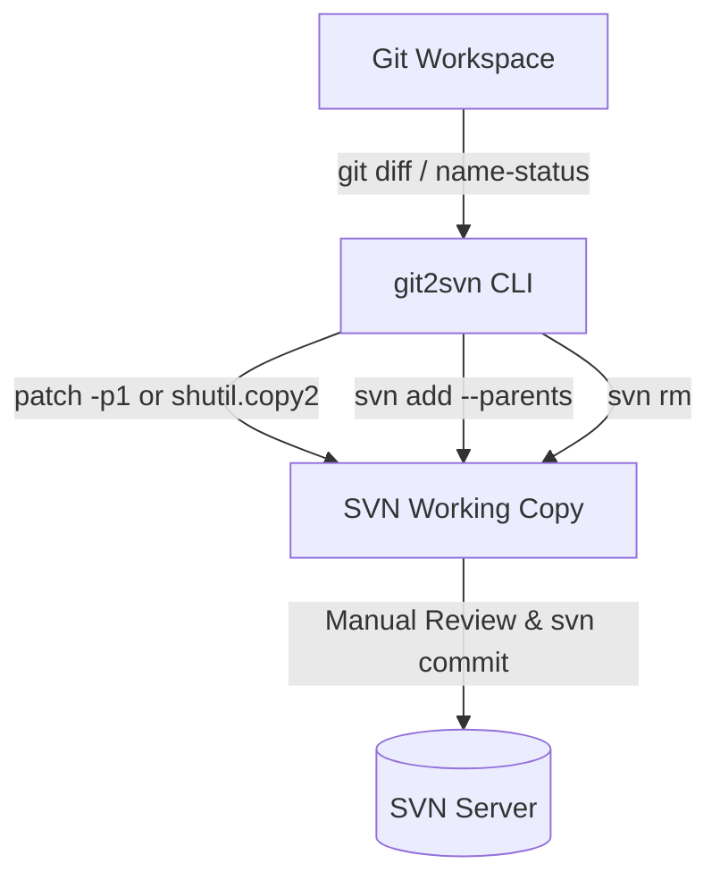
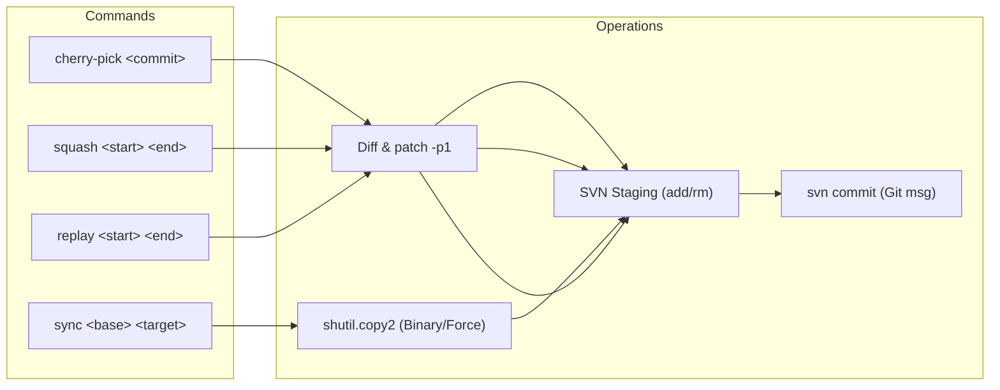

# Git-to-SVN Synchronization CLI (`git2svn`)

A lightweight, zero-dependency Python 3 CLI utility to bridge local Git development workspaces with an SVN monorepo working copy. It ports commits and branch changes accurately to SVN and stages structural operations (`svn add --parents`, `svn rm`), leaving final review and commits to the developer.

---

## 1. Introduction & Goals

### 1.1 Context & Problem Statement
In large legacy SVN monorepos, native `git-svn` suffers from severe memory bottlenecks and unacceptable clone/fetch times. A fast, one-way Git mirror maintained with tools like KDE's `all-fast-export/svn2git` allows developers to enjoy Git workflows locally.

This utility bridges the gap when pushing work back to SVN:
* **Git Workspace:** Active local development on feature/bugfix branches.
* **SVN Workspace:** Standard local SVN working copy used for code review and committing back to the upstream SVN server (via CLI or TortoiseSVN).

### 1.2 Architectural Constraints
* **Python 3 Standard Library:** Zero external dependencies (`argparse`, `subprocess`, `shutil`, `pathlib`).
* **Non-destructive:** The utility **never** executes `svn commit`. Final review and commits remain strictly under developer control.
* **Local Operations:** Runs entirely on local file paths without requiring SVN remote credentials or network connectivity during staging.

---

## 2. Architecture & Workflow (arc42 Overview)



### 2.1 Subcommands & Flow



---

## 3. Structural File Staging Mechanics

When applying diffs or copying files, `git2svn` inspects Git changes (`git diff --name-status`) and executes the corresponding Subversion structural commands:

| Git Status | Description | SVN Action Executed |
| :--- | :--- | :--- |
| **`A`** | Added file | Ensures parent directory exists, then runs `svn add <filepath> --parents` |
| **`D`** | Deleted file | Runs `svn rm <filepath>` |
| **`M`** | Modified file | No SVN structural command needed (contents updated via `patch` or `shutil`) |
| **`R`** | Renamed file (`R100 old new`) | Runs `svn rm <old_name>` and `svn add <new_name> --parents` |
| **`C`** | Copied file (`C100 src dst`) | Runs `svn add <new_name> --parents` |

---

## 4. CLI Usage & Commands

### 4.1 Global Options

Options can be supplied either before or after subcommands:

```bash
git2svn [-g/--git-dir <path>] [-s/--svn-dir <path>] [-n/--dry-run] [-v/--verbose] <command>
```

* `--svn-dir`, `-s`: Path to the local SVN checkout. Can also be set via `export SVN_DIR=/path/to/svn`.
* `--git-dir`, `-g`: Path to the Git repository (defaults to the current Git repository root).
* `--dry-run`, `-n`: Preview all file copies, diff patches, and SVN commands without modifying disk.
* `--verbose`, `-v`: Output debug logs and process execution details.

---

### 4.2 Subcommand A: `cherry-pick <commit_hash>`

Extracts the diff of a specific commit (`<commit>^..<commit>`) and applies it to the SVN workspace using `patch -p1`, followed by structural staging.

* `--commit`, `-c`: Automatically commit staged changes to SVN using the exact Git commit message.

```bash
# Example: Port a single bugfix commit (staged only, manual review)
./git2svn.py cherry-pick a1b2c3d4 --svn-dir /home/simon/svn/repo/trunk

# Example: Port and commit directly with the Git commit message
./git2svn.py cherry-pick a1b2c3d4 -c --svn-dir /home/simon/svn/repo/trunk
```

---

### 4.3 Subcommand B: `squash <start_ref> <end_ref>`

Ports a continuous range of Git commits (e.g. an entire feature branch) as a single unified changeset using `patch -p1`.

```bash
# Example: Squash an entire feature branch onto SVN trunk
./git2svn.py squash master feature/login-page --svn-dir /home/simon/svn/repo/trunk
```

---

### 4.4 Subcommand C: `sync <base_ref> <target_ref>`

Performs a brute-force file copy using Python's `shutil` for all modified and added files, bypassing the patch utility entirely.

> [!TIP]
> Use `sync` when dealing with binary files (images, compiled assets, PDFs), extensive refactors, or patch fuzz conflicts where `patch -p1` cannot cleanly apply.

```bash
# Example: Brute-force sync of branch changes
./git2svn.py sync master feature/asset-overhaul --svn-dir /home/simon/svn/repo/trunk
```

---

### 4.5 Subcommand D: `replay <start_ref> <end_ref>`

Sequentially ports a series of Git commits one-by-one to the SVN workspace, creating an individual `svn commit` for each Git commit using its original commit message.

```bash
# Example: Replay a series of 5 commits onto SVN
./git2svn.py replay master feature/login-flow --svn-dir /home/simon/svn/repo/trunk
```

#### Conflict Pause & Resume Workflow
If a commit fails to apply cleanly (patch reject / conflict):
1. **The replay halts immediately:** The SVN workspace remains cleanly committed up to the last successful commit. Replay state is saved in `<svn_dir>/.svn/git2svn-replay.json`.
2. **Resolve the conflict:** Open the conflicting file in your SVN workspace, resolve the issue, stage any file additions/removals with `svn add` or `svn rm`, and delete the leftover `*.rej` / `*.orig` files.
3. **Resume replay:**
   ```bash
   ./git2svn.py replay --continue
   ```
   *(This commits the resolved changeset using the paused Git commit's message and continues replaying the remaining queue).*

#### Conflict Abort & Skip
* **Abort:** Discards uncommitted changes from the failed commit and resets the SVN working copy:
  ```bash
  ./git2svn.py replay --abort
  ```
* **Skip:** Discards the failed commit and proceeds with the rest of the queue:
  ```bash
  ./git2svn.py replay --skip
  ```

---

## 5. Development & Testing

Run the test suite using standard Python `unittest`:

```bash
python3 -m unittest discover tests
```
