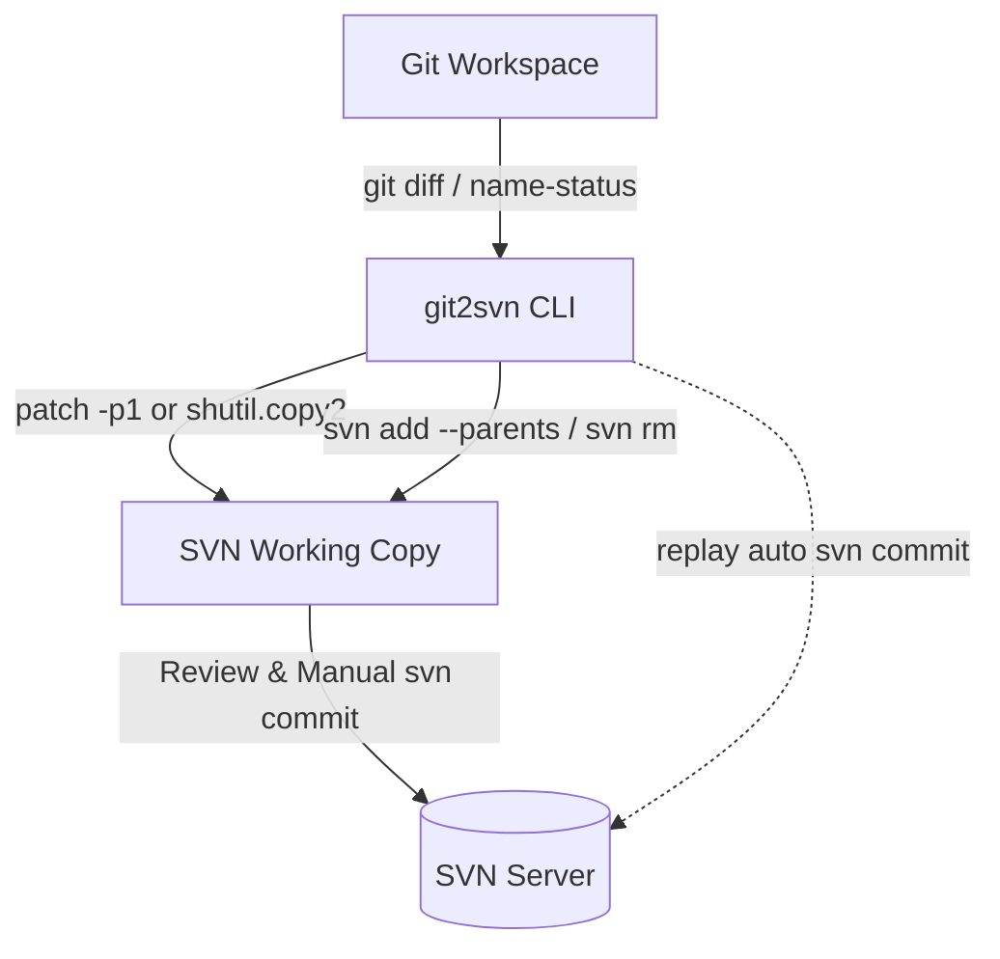
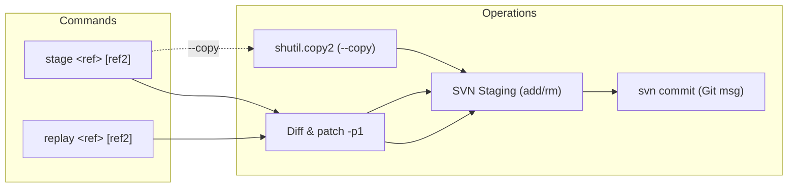

# Git-to-SVN Synchronization CLI (`git2svn`)

A lightweight, zero-dependency Python 3 CLI utility to bridge local Git development workspaces with an SVN monorepo working copy. It provides two symmetrical, intuitive commands to either stage changes for manual review (`stage`) or sequentially commit them into SVN history (`replay`).

---

## 1. Introduction & Goals

### 1.1 Context & Problem Statement
In large legacy SVN monorepos, native `git-svn` suffers from severe memory bottlenecks and unacceptable clone/fetch times. A fast, one-way Git mirror maintained with tools like KDE's `all-fast-export/svn2git` allows developers to enjoy Git workflows locally.

This utility bridges the gap when pushing work back to SVN:
* **Git Workspace:** Active local development on feature/bugfix branches.
* **SVN Workspace:** Standard local SVN working copy used for code review and committing back to the upstream SVN server (via CLI or TortoiseSVN).

### 1.2 Core Architectural Principles
* **Python 3 Standard Library:** Zero external dependencies (`argparse`, `subprocess`, `shutil`, `pathlib`).
* **Clean Separation of Intent:**
  * **`stage`:** Never commits. Prepares and stages changes (`svn add --parents`, `svn rm`) in the SVN workspace so you can inspect them via TortoiseSVN before committing.
  * **`replay`:** Always commits. Ports each Git commit into SVN history with its original commit message and stateful conflict pause/resume.
* **Flexible Reference Syntax:** Both commands accept a single commit (`abc1234`), a range with dot notation (`main..feature`), or two positional arguments (`main feature`).

---

## 2. Architecture & Workflow (arc42 Overview)



### 2.1 Consolidated Subcommands



---

## 3. Structural File Staging Mechanics

When applying diffs or copying files, `git2svn` inspects Git changes (`git diff --name-status`) and executes the corresponding Subversion structural commands:

| Git Status | Description | SVN Action Executed |
| :--- | :--- | :--- |
| **`A`** | Added file | Ensures parent directory exists, then runs `svn add <filepath> --parents` |
| **`D`** | Deleted file | Runs `svn rm <filepath>` |
| **`M`** | Modified file | No SVN structural command needed (contents updated via `patch` or `shutil`) |
| **`R`** | Renamed file (`R100 old new`) | Runs `svn rm <old_name>` and `svn add <new_name> --parents` |
| **`C`** | Copied file (`C100 src dst`) | Runs `svn add <new_name> --parents` |

---

## 4. CLI Usage & Commands

### 4.1 Global Options

Options can be supplied either before or after subcommands:

```bash
git2svn [-g/--git-dir <path>] [-s/--svn-dir <path>] [-n/--dry-run] [-v/--verbose] <command>
```

* `--svn-dir`, `-s`: Path to the local SVN checkout. Can also be set via `export SVN_DIR=/path/to/svn`.
* `--git-dir`, `-g`: Path to the Git repository (defaults to the current Git repository root).
* `--dry-run`, `-n`: Preview all file copies, diff patches, and SVN commands without modifying disk.
* `--verbose`, `-v`: Output debug logs and process execution details.

---

### 4.2 Command 1: `stage <ref1> [ref2] [--copy]`

Prepares changes in the SVN workspace **without committing**, ready for review in TortoiseSVN or CLI.

* **Single Commit:** Ports the diff of a single commit.
  ```bash
  # Stage a single commit
  ./git2svn.py stage a1b2c3d4 --svn-dir /path/to/svn
  ```
* **Range (Squash):** Squashes an entire branch into a single set of uncommitted SVN changes.
  ```bash
  # Stage a range using dot notation
  ./git2svn.py stage master..feature/login --svn-dir /path/to/svn

  # Stage a range using two arguments
  ./git2svn.py stage master feature/login --svn-dir /path/to/svn
  ```
* **Binary / Conflict Fallback (`--copy`):**
  Uses Python's `shutil` to physically copy modified/added files instead of `patch -p1`.
  ```bash
  # Brute-force file copy (ideal for binaries, images, or heavy refactors)
  ./git2svn.py stage master..feature/assets --copy --svn-dir /path/to/svn
  ```

---

### 4.3 Command 2: `replay <ref1> [ref2]`

Sequentially ports Git commit(s) onto the SVN workspace, creating an atomic `svn commit` for each with its original Git commit message.

* **Single Commit (Cherry-pick):**
  ```bash
  # Replay and commit a single Git commit
  ./git2svn.py replay a1b2c3d4 --svn-dir /path/to/svn
  ```
* **Range (Fast-forward Merge):**
  ```bash
  # Replay an entire feature branch commit-by-commit
  ./git2svn.py replay master..feature/login --svn-dir /path/to/svn
  ```

#### Conflict Pause & Resume Workflow
If a patch conflict occurs during a replay:
1. **Execution pauses:** The SVN workspace remains cleanly committed up to the last successful commit. Replay state is saved in `<svn_dir>/.svn/git2svn-replay.json`.
2. **Resolve the issue:** Fix conflicting files in your SVN workspace, stage new/deleted files with `svn add` / `svn rm`, and delete any leftover `*.rej` / `*.orig` files.
3. **Resume replay:**
   ```bash
   ./git2svn.py replay --continue
   ```
   *(This automatically commits the resolved changeset with the Git message and continues with the rest of the queue).*

#### Conflict Abort & Skip
* **Abort:** Reverts uncommitted changes from the failed commit and resets the SVN working copy:
  ```bash
  ./git2svn.py replay --abort
  ```
* **Skip:** Discards the failed commit and proceeds with the rest of the queue:
  ```bash
  ./git2svn.py replay --skip
  ```

---

## 5. Development & Testing

Run the test suite using standard Python `unittest`:

```bash
python3 -m unittest discover tests
```
