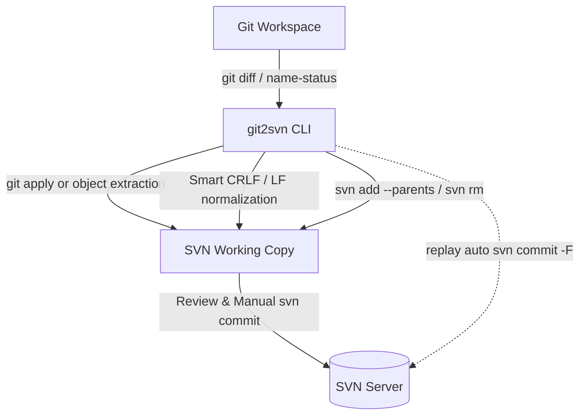

# Git-to-SVN Synchronization CLI (`git2svn`)

<p align="center">
  <a href="https://github.com/simon123h/git2svn/actions/workflows/ci.yml"></a>
  
  
  <a href="https://github.com/simon123h/git2svn/releases"></a>
  <a href="LICENSE.md"></a>
</p>

A lightweight, zero-dependency Python 3 CLI utility to bridge local Git development workspaces with a Subversion (SVN) monorepo working copy. It provides two symmetrical, intuitive commands to either stage changes for manual review (`stage`) or sequentially commit them into SVN history (`replay`).

---

## Key Highlights

- **Zero External Dependencies:** Built purely on Python 3 standard library and standard `git`/`svn` CLI tools.
- **Smart CRLF/LF Normalization:** Automatically reconciles line endings post-patch, preventing Subversion `E135000: Inconsistent line ending style` commit failures.
- **Clean Intent Model:**
  - `stage`: **Never commits.** Staged in SVN (`svn add`, `svn rm`) for inspection in TortoiseSVN or CLI before manual commit.
  - `replay`: **Always commits.** Sequentially ports Git commits into SVN with original author messages and a stateful conflict recovery lifecycle.
- **Flexible Reference Syntax:** Accepts single commits (`abc1234`), range notation (`main..feature`), or two positional arguments (`main feature`).
- **Binary & Snapshot Support:** Direct object DB extraction (`--copy`) for binary assets and whole-tree alignment (`--snapshot`).

---

## Quick Start

### Installation

No package installation required. Run directly with Python 3:

```bash
# Clone the repository
git clone https://github.com/simon123h/git2svn.git
cd git2svn

# (Optional) Install CLI globally or into your virtual environment:
pip install .

# Or install the latest release wheel directly from GitHub Releases:
# pip install https://github.com/simon123h/git2svn/releases/latest/download/git2svn-<version>-py3-none-any.whl
```

### Basic Commands

```bash
# Optional: Set default SVN path in your Git repository so you don't need -s on every command
git config git2svn.svnDir /path/to/svn

# 1. Stage a single Git commit into SVN for review (uncommitted)
git2svn stage a1b2c3d4 -s /path/to/svn

# 2. Squash an entire feature branch into an uncommitted SVN changeset
git2svn stage main..feature/login

# 3. Replay an entire feature branch commit-by-commit into SVN history
git2svn replay main..feature/login

# 4. Resume an interrupted replay after resolving conflicts
git2svn replay --continue
```

---

## Architecture at a Glance



---

## Documentation

Comprehensive documentation-as-code is maintained in the [`docs/`](docs/) folder:

- **[User Guide](docs/user-guide/README.md):** Complete CLI options, [command reference](docs/user-guide/commands.md), the [Git Integration Branch Workflow](docs/user-guide/integration-workflow.md), and [troubleshooting FAQ](docs/user-guide/troubleshooting.md).
- **[Architecture Documentation](docs/arc42/README.md):** Architectural design, package building blocks, runtime sequence diagrams, [cross-cutting concepts](docs/arc42/concepts.md), and [Architecture Decision Records (ADRs)](docs/arc42/adrs.md).
- **[Requirements Specification](docs/req42.md):** Detailed stakeholders, functional requirements, and quality goals.
- **[Contributing Guidelines](CONTRIBUTING.md):** Development setup, coding conventions, Conventional Commits, and test instructions.

---

## Development & Testing

```bash
# Run unit & integration tests
python3 -m unittest discover tests

# Lint and format with Ruff
ruff check --fix .
ruff format .

# Enable pre-commit hook
git config core.hooksPath .githooks
# or use pre-commit framework: pre-commit install
```


---

## License

Distributed under the [Apache-2.0 License](LICENSE.md).
