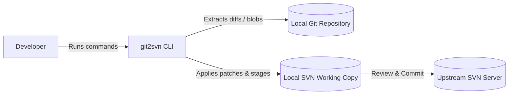
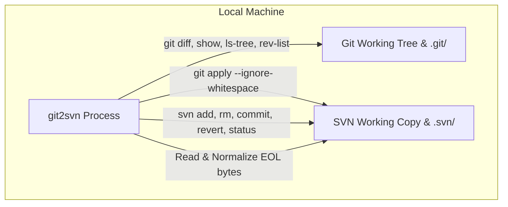
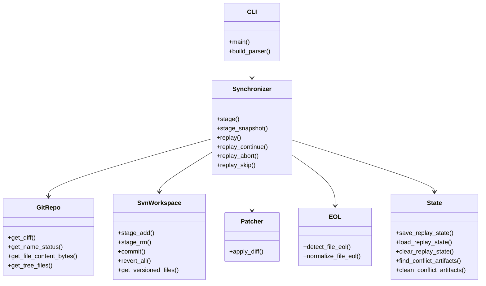
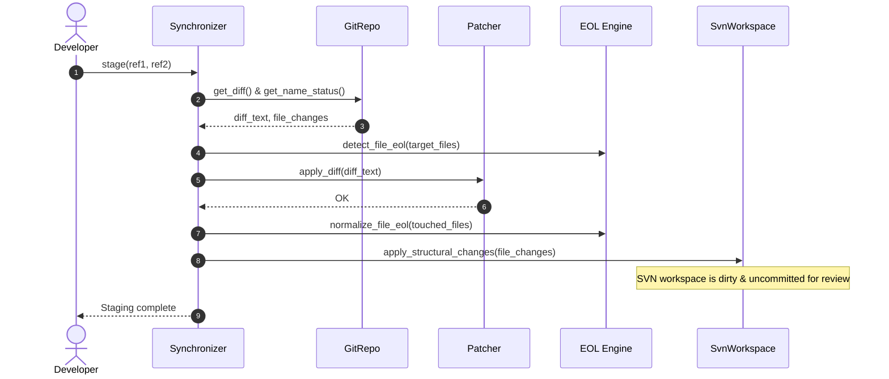
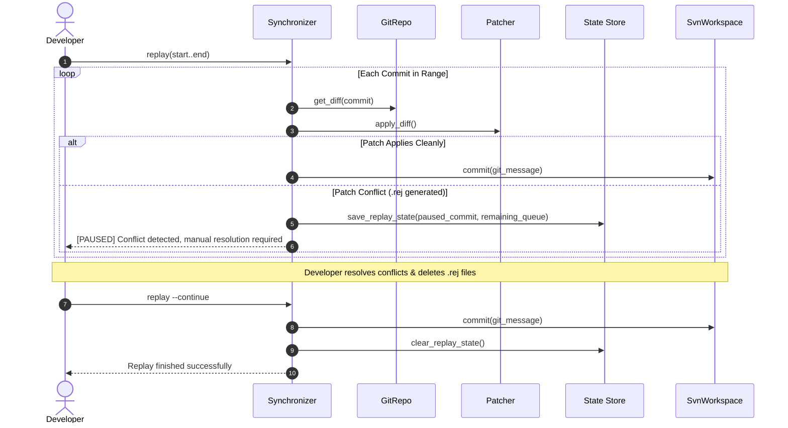

# arc42 Architecture Documentation: `git2svn`

This document describes the software architecture of `git2svn` using the [arc42](https://arc42.org/) architectural template.

---

## 1. Introduction and Goals

### 1.1 Requirements Overview
`git2svn` is a lightweight, zero-dependency Python 3 utility designed to synchronize changes from a local Git repository to a local Subversion (SVN) working copy. It addresses the unidirectional impedance mismatch between Git feature branches and monolithic legacy SVN repositories.

### 1.2 Quality Goals
1. **Zero External Runtime Dependencies:** Python 3 standard library only (`argparse`, `pathlib`, `subprocess`, `json`, `shutil`).
2. **Predictable Commit Boundary:** Clear distinction between uncommitted staging (`stage`) and automatic sequential commits (`replay`).
3. **Format Robustness:** Transparent line-ending (`CRLF`/`LF`) normalization, resolving Subversion's strict `E135000: Inconsistent line ending style` constraint.
4. **Stateful Conflict Recovery:** Atomic commit pause/resume lifecycle during multi-commit replays.

### 1.3 Stakeholders
* **Git Developers:** Local development, branching, and rebasing.
* **SVN Maintainers / Leads:** Code reviews in TortoiseSVN or standard Subversion tooling.

---

## 2. Architecture Constraints

* **Platform Compatibility:** Must run natively on Linux, macOS, and Windows.
* **Tooling Dependencies:** Relies only on standard `git` and `svn` CLI binaries found in `PATH`.
* **Subversion Mechanics:** Must never mutate the internal `.svn` metadata directory, except for storing harmless state in `.svn/git2svn-replay.json`.

---

## 3. Context and Scope

### 3.1 Business Context



### 3.2 Technical Context



---

## 4. Solution Strategy

1. **Two Consolidated Verbs:**
   * `stage`: Always leaves the SVN workspace uncommitted. Supports standard patch application, direct Git object DB snapshot extraction (`--copy`), and whole-tree alignment (`--snapshot`).
   * `replay`: Always commits each Git commit with its original message. Enforces linear history and provides stateful conflict pause/continue/abort/skip.
2. **Patcher Engine:** Replaced GNU `patch` with `git apply --ignore-whitespace --unsafe-paths --reject` to eliminate Windows prerequisites and natively parse Git diff extensions.
3. **Smart EOL Normalization:** Pre-inspects original file newline style, applies diffs, and normalizes all touched files back to their target line-ending style (`\r\n` or `\n`), skipping binaries and symlinks.

---

## 5. Building Block View

### 5.1 Level 1: Package Overview



### 5.2 Level 2: Component Responsibilities

| Component | File | Responsibility |
| :--- | :--- | :--- |
| **CLI Controller** | `git2svn/cli.py` | Argument parsing, help output, pre-flight target banner, command dispatch, and exit codes. |
| **Synchronizer Service** | `git2svn/core.py` | Orchestrates diff application, object extraction, EOL normalization, replay loop, and conflict lifecycle. |
| **Git Adapter** | `git2svn/git.py` | Encapsulates `git` subprocess executions, ref parsing, name-status parsing, and object extraction. |
| **SVN Adapter** | `git2svn/svn.py` | Encapsulates `svn` subprocess executions (`add`, `rm`, `commit`, `revert`, `info`, `status`). |
| **Patcher** | `git2svn/patcher.py` | Encapsulates `git apply` with whitespace tolerance and reject file creation. |
| **EOL Utilities** | `git2svn/eol.py` | Detects predominant newlines (`\r\n` vs `\n`) and unifies lines, skipping binaries and symlinks. |
| **State Persistence** | `git2svn/state.py` | Manages `<svn_dir>/.svn/git2svn-replay.json` and conflict cleanup (`*.rej`, `*.orig`). |

---

## 6. Runtime View

### 6.1 Staging Changes (`stage`)



### 6.2 Replay with Conflict Pause and Resume



---

## 7. Deployment View

`git2svn` can be deployed and executed in three flexible ways:
1. **Direct Script Execution:**
   ```bash
   ./git2svn.py <command>
   ```
2. **Python Module Execution:**
   ```bash
   python3 -m git2svn <command>
   ```
3. **Pip Installation (User or Virtual Environment):**
   ```bash
   pip install .
   git2svn <command>
   ```

---

## 8. Cross-Cutting Concepts

### 8.1 Line Ending Mechanics
* Git diffs are unified in `LF`.
* When applying to a `CRLF` file, `git apply --ignore-whitespace` matches hunks cleanly but inserts new lines as `LF`.
* Post-patch normalization inspects the original file format and replaces all line endings to guarantee pure `\r\n` or `\n` uniformity.
* Prevents Subversion error `svn: E135000: Inconsistent line ending style`.

### 8.2 Conflict Artifact Management
* Patch rejections produce `filename.rej`.
* State persistence records current failed commit hash, commit message, and remaining queue in `.svn/git2svn-replay.json`.
* `replay --continue` guards against premature resumption by enforcing that all `*.rej` and `*.orig` files are resolved and removed.

### 8.3 Integration Branch Pattern (Git-to-SVN Inbound/Outbound Sync)
* Inbound SVN changes are mirrored incrementally to a tracking branch (e.g. `svn-mirror/trunk`) via `svn2git`/`all-fast-export`.
* Development occurs on local topic branches, which are integrated via fast-forward or squash into a local `trunk` staging branch.
* `git2svn replay -u svn-mirror/trunk..trunk` performs the outbound synchronization to SVN.
* Following replay, `trunk` is reset to the authoritative SVN mirror (`git reset --hard svn-mirror/trunk`), eliminating drift and merge conflicts.

---

## 9. Architecture Decisions (ADR Summary)

* **ADR-1: 2-Verb CLI Model (`stage` and `replay`):** Consolidate separate patch/copy/cherry-pick commands to preserve intuitive semantics: staging never commits; replay always commits.
* **ADR-2: `git apply` over GNU `patch`:** Eliminates external Windows dependency on `patch.exe` and natively handles Git diff extensions.
* **ADR-3: Post-Patch EOL Normalization:** Reconciles mixed newline styles dynamically without mutating uncommitted files before patching.
* **ADR-4: `--snapshot` Full Tree Alignment:** Provides an escape hatch when branches diverge or Git base revision is unknown.
* **ADR-5: Zero External Dependencies:** Preserves lightweight portable design runnable anywhere with Python 3.8+.
* **ADR-6: Commit Message Delivery via Temporary File (`-F`):** Passes commit logs to `svn commit` via a temporary UTF-8 file instead of `-m "..."` to bypass Windows `cmd.exe` command-line length limits (8,191 chars) and quoting breakage.
* **ADR-7: Explicit Subprocess UTF-8 Encoding:** Standardizes `encoding="utf-8", errors="replace"` across all `subprocess.run` calls, preventing Windows ANSI/OEM (`cp1252`) encoding crashes on non-ASCII commit logs or diffs.
* **ADR-8: Windows Subversion Executable Auto-Discovery:** Resolves `svn.exe` from `PATH` or standard installation locations (`C:\Program Files\TortoiseSVN\bin\svn.exe`, `SlikSvn`) on Windows.
* **ADR-9: Configuration Persistence via `.git/config`:** Leverages native `git config` (`git2svn.*`) for local repository settings (`svnDir`, `dryRun`, `copy`, `defaultRange`, `autoUpdate`), avoiding extra configuration files or project tree clutter.
* **ADR-10: Optional Post-Replay Working Copy Update (`--update` / `git2svn.autoUpdate`):** Solves Subversion's mixed-revision behavior where the working copy base revision remains behind `HEAD` after commits. Made opt-in to avoid network latency and unexpected remote tree merges on slow or concurrent shared SVN repositories.

