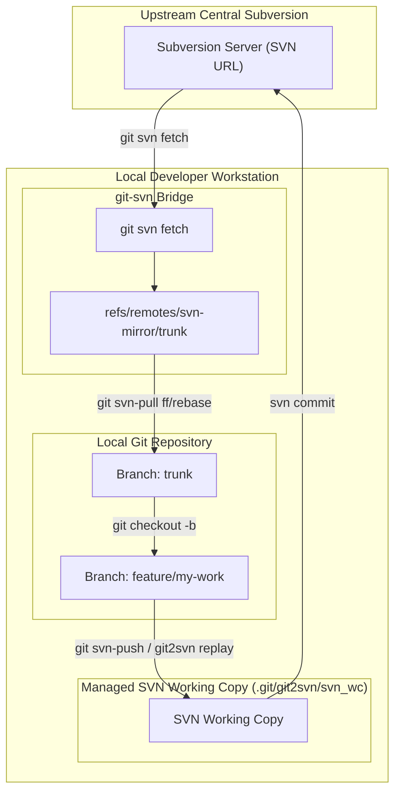

# Architecture Decisions (ADR Summary)

This document contains the Architecture Decision Records (ADRs) for `git2svn`.

---

### ADR-1: 2-Verb CLI Model (`stage` and `replay`)
* **Context:** Early designs featured overlapping commands like `patch`, `copy`, `cherry-pick`, and flags for partial commits.
* **Decision:** Consolidate around two core verbs with strict commit boundaries:
  - `stage`: **Never commits.** Prepares changes in SVN workspace (`svn add`, `svn rm`), leaving files dirty for review or squash commits.
  - `replay`: **Always commits.** Sequentially ports individual Git commits with original author messages.
* **Consequences:** Eliminates accidental commits, provides intuitive user semantics, and aligns with developers' mental models.

---

### ADR-2: `git apply` over GNU `patch`
* **Context:** The original prototype used GNU `patch`. On Windows, GNU `patch` is not natively installed and often mishandles Git diff headers (renames, binary diffs, mode changes).
* **Decision:** Rely on `git apply --ignore-whitespace --unsafe-paths --reject`.
* **Consequences:** Eliminates external Windows dependencies (since `git` is already guaranteed to exist) and reliably processes all Git diff metadata.

---

### ADR-3: Post-Patch EOL Normalization
* **Context:** Git unified diffs use `LF` newlines. Applying an `LF` patch to a `CRLF` file in Subversion causes mixed line endings in the same file. Subversion commits fail with fatal error `svn: E135000: Inconsistent line ending style`.
* **Decision:** Pre-inspect original file line endings before applying the patch. After patching, normalize touched text files to match the detected style (`\r\n` or `\n`), skipping binaries and symlinks.
* **Consequences:** Transparent commit success on Windows and cross-platform repositories without requiring repository-wide newline churn.

---

### ADR-4: `--snapshot` Full Tree Alignment
* **Context:** When a feature branch heavily diverges from SVN, or when cherry-picks occurred in SVN out-of-order, computing a patch against a common Git ancestor fails with massive conflicts.
* **Decision:** Provide `stage --snapshot <ref>`, which compares the tree of `<ref>` directly with the SVN filesystem, calculating additions, deletions, and modifications without needing a common base commit.
* **Consequences:** Serves as a foolproof escape hatch to realign divergent trees in a single reviewable staging step.

---

### ADR-5: Zero External Runtime Dependencies
* **Context:** Python packaging often introduces complex virtual environment and dependency management hurdles.
* **Decision:** Use only the Python 3 standard library (`argparse`, `pathlib`, `subprocess`, `json`, `shutil`, `tempfile`).
* **Consequences:** Single-file script or portable wheel runnable immediately on any developer workstation or CI environment without `pip install` prerequisites.

---

### ADR-6: Commit Message Delivery via Temporary File (`-F`)
* **Context:** Passing multi-line or long commit messages via `svn commit -m "..."` hits Windows `cmd.exe` command-line length limits (8,191 characters) and suffers from shell escaping and quotation breakage.
* **Decision:** Write commit messages to a temporary UTF-8 file and invoke `svn commit -F <tempfile>`.
* **Consequences:** Supports arbitrary message lengths, multi-paragraph markdown bodies, and special characters cleanly.

---

### ADR-7: Explicit Subprocess UTF-8 Encoding
* **Context:** On Windows, Python subprocesses default to the active OEM code page (e.g. `cp1252` or `cp850`), crashing when processing Git logs or diffs containing UTF-8 characters (umlauts, emojis, accented names).
* **Decision:** Explicitly specify `encoding="utf-8", errors="replace"` on all subprocess executions.
* **Consequences:** Robust internationalization and character preservation across all operating systems.

---

### ADR-8: Windows Subversion Executable Auto-Discovery
* **Context:** TortoiseSVN on Windows installs `svn.exe` into `C:\Program Files\TortoiseSVN\bin\svn.exe`, but doesn't always add it to user `PATH`.
* **Decision:** Implement automatic search in standard TortoiseSVN and SlikSvn directories if `svn` is not found on `PATH`.
* **Consequences:** Seamless out-of-the-box operation for TortoiseSVN users on Windows.

---

### ADR-9: Configuration Persistence via `.git/config`
* **Context:** Passing `--svn-dir` on every invocation is tedious and error-prone. Introducing a `.git2svnrc` or JSON file litters the workspace and risks accidental commits into Git.
* **Decision:** Read settings directly from the local Git repository's `.git/config` via `git config git2svn.*` (`svnDir`, `dryRun`, `copy`, `defaultRange`, `autoUpdate`).
* **Consequences:** Zero workspace clutter, repository-scoped persistence, and clean precedence (CLI > Env > Git Config > Defaults).

---

### ADR-10: Mandatory Working Copy Updates (Pre and Post Operations)
* **Context:** Subversion's mixed-revision working copy design leaves the local root revision behind `HEAD` after commits, hiding new revisions from `svn log` until `svn update` is run. Furthermore, in managed working copy environments (`.git/git2svn/svn_wc/`), staging or replaying against an out-of-date base revision leads to catastrophic `svn: E155015: Item is out of date` conflicts.
* **Decision:** Treat `svn update` as a mandatory correctness invariant rather than an optional configuration setting. `git2svn` automatically updates the working copy prior to staging or replaying (to align against remote `HEAD`), and automatically updates the working copy upon successful replay completion. The `--no-update` flag and `git2svn.autoUpdate` config have been removed to eliminate unsafe partial-revision states.
* **Consequences:** Guarantees atomic correctness and eliminates out-of-date collisions across multi-commit workflows.

---

### ADR-11: No Author/Metadata Preservation or Date Spoofing
* **Context:** In Git, commits carry distinct author and committer names, emails, and historical timestamps. Subversion tracks revision properties (`svn:author`, `svn:date`) which are either immutable by default or require custom server-side hook scripts (`pre-revprop-change`) that are typically locked down in enterprise SVN deployments. Modifying revision properties or spoofing commit timestamps/authors can create security, audit, and traceability concerns, in addition to introducing server-dependent replay failures.
* **Decision:** Explicitly reject author spoofing, date manipulation, or artificial metadata rewriting in `git2svn`. All replayed commits are committed using the active SVN working copy user credentials and the current server timestamp. Original Git commit messages are preserved verbatim, but author identity and commit time in SVN remain authoritative to the person running the tool at the time of execution.
* **Consequences:**
  - Guarantees compatibility with all SVN servers out of the box without requiring `pre-revprop-change` server hook privileges.
  - Maintains strict organizational accountability: the committer who pushes the changes to SVN is always the verified SVN user.
  - Avoids temporal inconsistencies in SVN repositories where revisions must strictly increase in time.
  - Keeps the codebase lightweight and free of brittle revision-property manipulation logic.

---

### ADR-12: Scope Boundary: Adapter Bridge vs. Autonomous Master-Slave Exporter
* **Context:** In scenarios where Git is the sole upstream source of truth without an automated reverse `svn2git` mirror creating tracking branches (e.g. `origin/svn-mirror/trunk`), `git2svn` has no external reference point to determine which Git commit corresponds to the current state of the SVN working copy. To operate autonomously without an explicit Git range or external mirror, `git2svn` would need to record and track synchronization state across boundaries (e.g. via SVN commit trailers, custom root revision properties, or local/remote sync tags), implement out-of-band conflict reconciliation logic, and handle multi-branch topology mapping.
* **Decision:** Explicitly maintain `git2svn`'s scope as a lightweight, stateless **adapter bridge** rather than an autonomous master-slave repository replication system:
  1. `git2svn` will not take on the responsibility of an internal state machine or persistent cross-VCS metadata synchronization engine.
  2. In the standard workflow, state and collision detection remain externalized in Git (via mirror tracking branches) and SVN working copy revisions.
  3. When operating without an SVN-to-Git mirror, `git2svn` continues to function reliably as an explicit delivery tool via user-directed arguments:
     - `git2svn replay <base-commit>..<target-commit>` (explicitly providing the base commit where SVN last left off).
     - `git2svn stage --snapshot <target-ref>` (statelessly projecting the desired Git tree onto the SVN workspace without requiring historical ancestry).
* **Consequences:**
  - Preserves Unix philosophy: `git2svn` focuses solely on reliably applying Git diffs and tree states to an SVN working copy.
  - Keeps the codebase lean, robust, and free of fragile metadata synchronization or repository reconciliation logic.
  - Avoids architectural divergence and false promises regarding bidirectional synchronization or unmanaged out-of-band SVN mutations.

---

### ADR-13: Managed Working Copy in `.git/git2svn/svn_wc/`
* **Context:** Requiring users to manually create and pass an SVN working copy directory (`--svn-dir`) adds friction compared to tools like `git-svn`. However, directly committing to remote SVN servers via `svnmucc` or SWIG Python bindings would add immense complexity (directory lifecycle management, binary chunking, loss of local patch conflict inspection, or non-portable C-extension dependencies).
* **Decision:** Implement a **Managed Working Copy** architecture.
  1. `git2svn setup <url-or-path>` dynamically detects whether the argument is a local working copy or an SVN repository URL (`https://`, `svn://`, `file://`, etc.).
  2. When an SVN URL is provided, `git2svn` automatically checks out the working copy to `.git/git2svn/svn_wc/` and persists `git2svn.svnUrl` and `git2svn.svnDir` in `.git/config`.
  3. All operational commands (`stage`, `replay`, `diff`, `status`) seamlessly resolve this managed path without requiring `--svn-dir`.
  4. If `.git/git2svn/svn_wc/` is deleted (or on a fresh clone), `git2svn` automatically and transparently self-heals by re-checking out the repository using the configured `git2svn.svnUrl`.
* **Consequences:**
  - Delivers the checkout-free convenience of `git-svn` without introducing C-extension dependencies or fragile direct-to-server transaction engines.
  - Automatically bound to the repository lifecycle: deleting the Git repository completely cleans up the working copy with zero orphan cache accumulation.
  - Invisible to Git status (located within `.git/`).
  - Preserves 100% of local patching, line ending normalization, and interactive conflict recovery mechanisms.

---

### ADR-14: Pre-Push Mirror Remote Protection Guard
* **Context:** In standard Git-SVN workflows where Subversion is the authoritative source of truth and a tool like `svn2git` mirrors SVN commits to a Git remote tracking branch (e.g. `origin` or `svn-mirror`), developers can easily shoot themselves in the foot by accidentally running `git push` directly against the mirror remote. Pushing Git commits directly to the mirror remote causes Git and SVN histories to diverge, breaking automated `svn2git` sync loops. Furthermore, mixing PR/collaboration feature branches on the mirror remote pollutes the SVN mirror namespace. Team collaboration and PRs should happen on a separate developer remote (e.g. personal fork or dedicated PR remote).
* **Decision:** `git2svn setup` automatically installs a strict **pre-push hook guard** into `.git/hooks/pre-push` that blocks **all pushes** to the mirror remote:
  1. The hook checks the target `REMOTE_NAME` passed via Git's positional arguments (`$1`).
  2. If the push targets the configured mirror remote (`origin` or `svn-mirror`), the hook immediately aborts the push with exit code 1 regardless of target branch.
  3. It prints clear, actionable guidance explaining that the mirror remote is read-only, changes to SVN must be published via `git2svn replay` (or `git svn-push`), and branch collaboration should be pushed to a separate developer remote.
  4. Pushes to any other configured remote (e.g. `myfork`, `gitlab`, `pr-origin`) are permitted without restriction.
  5. The hook installation is idempotent and preserves any existing user pre-push scripts by appending/updating a marked section block (`# --- START GIT2SVN PRE-PUSH GUARD ---`).
* **Consequences:**
  - **Eliminates Accidental Mirror Pushes:** Completely prevents developers from pushing to the mirror remote, keeping it pristine for `svn2git` automation.
  - **Clear Separation of Concerns:** Enforces clean separation between read-only SVN mirror remotes and human collaboration/PR remotes.
  - **Robust and Simple:** Eliminates complex ref-parsing corner cases (tags, branch deletions, force-pushes); the entire remote is protected unconditionally.
  - **Zero external dependencies:** Pure POSIX shell hook executed by Git itself.

---

### ADR-15: Delta-Based Patching vs. Whole-Tree Mirroring
* **Context:** In active multi-developer teams, colleagues frequently commit changes directly to the central Subversion repository. In typical setups where a background service or script (`svn2git`) mirrors SVN commits back into Git, there is often a latency gap: the local Git repository does not yet know about the newest SVN commits. A naive architectural redesign might attempt to simplify `git2svn` by eliminating unified diff patching (`git apply`) in favor of whole-tree snapshot mirroring (e.g. wiping/overwriting the SVN working copy with Git's file tree via `git archive` or snapshot sync).
* **Decision:** Strictly retain **delta-based patch application** (`git diff | git apply`) on top of an updated SVN working copy (`svn update`) for standard replay operations.
  1. Whole-tree snapshotting is strictly relegated to explicit manual realignments via `stage --snapshot`.
  2. Sequential commit replay extracts only the discrete diff between parent and child Git commits.
  3. The diff is applied against the working copy containing the latest SVN HEAD.
  4. Non-overlapping colleague edits are automatically preserved by Subversion's 3-way merge capabilities; overlapping edits trigger standard patch/merge conflict resolution rather than silent data overwrites.
* **Consequences:**
  - **Zero Silent Data Loss:** Changes committed by teammates to SVN that have not yet been reflected in Git are never deleted or clobbered.
  - **Architectural Justification for the SVN Working Copy:** Confirms why a local SVN working copy is indispensable over direct server-side transaction tools (e.g. `svnmucc`), as a local working copy is required to compute 3-way merges and surface interactive conflict markers.
  - **Accepts Patch Complexity:** Acknowledges the necessity of EOL normalization, reject handling, and whitespace tolerance as essential trade-offs to guarantee non-destructive concurrent synchronization.

---

### ADR-16: Automatic Duplicate Replay Skipping via SVN Log Inspection
* **Context:** Developers frequently work iteratively on feature branches: committing changes, running `git2svn replay main..feature`, authoring further commits on the same feature branch, and running `git2svn replay main..feature` again before the upstream SVN mirror has synced back to `main`. When re-running `replay` across the full range, earlier commits in the branch are already present in Subversion. Re-applying those patches leads to failed patch applications (`.rej` artifacts) or redundant duplicate commits.
* **Decision:**
  1. Before executing the replay queue, query the most recent SVN commit log messages using `svn log --xml -l <limit>`.
  2. Perform **ordered consecutive prefix matching**: inspect the chronological Git commits against the most recent SVN log entries in reverse order (`[newest_svn, ..., oldest_svn]`).
  3. Only skip the contiguous sequence of commits starting from the head of the branch that have already been committed to SVN. If multiple commits share identical messages (e.g. repeated `"style: formatted"`), each is consumed in order; only the instances already committed in SVN are skipped.
  4. Once a Git commit has no counterpart in SVN, all subsequent commits in the queue are executed.
  5. Provide a `--force` CLI option on `git2svn replay` to bypass this check if a developer intentionally wishes to re-apply already committed changes.
* **Consequences:**
  - **Safe Iterative Replays:** Running `git2svn replay main..feature` multiple times on an evolving branch becomes idempotent and avoids spurious patch conflicts.
  - **Resilient to Duplicate Messages:** Avoids naive set-membership false skips when multiple commits have identical messages (e.g. `"style: formatted"`).
  - **Decoupled from Upstream Mirror Latency:** Developers do not need to wait for `svn2git` or CI sync jobs to complete before continuing work and replaying new commits.
  - **Zero Database State Needed:** Relies on Subversion's actual repository log as the authoritative source of truth, avoiding local metadata tracking corruption or commit hash trailer desynchronization after CRLF conversion.

---

### ADR-17: SVN Target Branch Awareness, Working Copy Switching, and Mismatch Guard
* **Context:** In enterprise environments where Subversion hosts multiple branches (e.g. `^/trunk`, `^/branches/feature-x`, `^/branches/release-1.0`), users working in Git across different local branches need to commit their work to the corresponding branch in SVN. Without branch awareness:
  1. Users must manually manage Subversion working copies or run raw `svn switch` commands against internal URLs.
  2. If a developer is currently on Git branch `feature-b` while the SVN working copy is switched to `trunk`, running `git2svn replay` would accidentally commit feature branch code directly into Subversion trunk.
  3. Hardcoding a static default range like `origin/trunk..trunk` fails when working on feature branches.
* **Decision:** Introduce first-class **SVN Target Branch Awareness**:
  1. **Working Copy Switching (`git2svn switch <branch>`):**
     - Accepts shorthand names: `trunk`, `main`, and `master` resolve to `^/trunk`.
     - Custom names (`feature-a`, `bugfix/issue-1`) resolve to `^/branches/<name>`.
     - Explicit repository-relative paths (`^/...`) or full URLs are preserved.
     - Validates that the working copy has no uncommitted changes before switching.
  2. **Branch Mismatch Detection Guard:**
     - Before replaying, `git2svn` compares the active Git branch (`git rev-parse --abbrev-ref HEAD`) against the SVN working copy branch.
     - Normalizes standard root aliases (`trunk`, `main`, and `master`) as equivalent.
     - If the Git branch and SVN branch differ, `git2svn` displays a prominent warning badge and prompts for interactive confirmation (`Do you want to proceed? [y/N]: `), aborting if denied.
     - Provides `-y` / `--yes` / `--force` flags to bypass the prompt in automated/scripted workflows. In non-interactive environments (`sys.stdin.isatty() == False`), logs a warning and proceeds.
  3. **Dynamic Default Range Fallback:**
     - When no range is supplied, `git2svn` queries the active SVN working copy branch name (`<svn-branch>`).
     - Detects the mirror remote (`svn-mirror` or `origin`) and verifies whether `<mirror>/<svn-branch>` exists.
     - If found, dynamically calculates the replay range as `<mirror>/<svn-branch>..HEAD`.
* **Consequences:**
  - **Accident Prevention:** Guards against accidental commits of Git feature branches into SVN trunk or vice-versa.
  - **Frictionless Branching:** Developers switch their SVN target branch with a single command without memorizing repository URLs.
  - **Smart Defaults:** `git2svn replay` "just works" on feature branches matching upstream SVN tracking branches without manual range specification.

---

### ADR-18: Mirror Remote Topology Configuration (`git2svn.mirrorRemote`) and Removal of `defaultRange`
* **Context:** Previously, `git2svn setup` wrote a static `git2svn.defaultRange` (e.g. `svn-mirror/trunk..trunk`). This caused "branch sticking": when checking out a feature branch, running `git2svn replay` either attempted to replay `trunk` or required remembering manual range syntax (`git2svn replay svn-mirror/feature-a..HEAD`). Furthermore, a hardcoded range conflated topology (which remote is the SVN mirror) with runtime branch state (which branch is currently checked out) and created configuration bloat.
* **Decision:**
  1. Promote **`git2svn.mirrorRemote`** as the primary configuration key created by `git2svn setup` (auto-detecting `svn-mirror`, `origin`, etc.).
  2. **Fully remove `git2svn.defaultRange`**: No longer written by setup, no longer parsed by CLI or core logic, and removed from documentation.
  3. Dynamic range calculation (`resolve_sync_range`) automatically resolves:
     $$\text{Sync Range} = \langle\text{mirrorRemote}\rangle/\langle\text{active-svn-branch}\rangle..\text{HEAD}$$
  4. One-off non-standard mappings or mirrorless workflows specify the desired range directly on the command line (e.g., `git2svn replay base..HEAD`), keeping configuration minimal and predictable.
  5. Both `status` and `replay`/`stage` share the unified `resolve_sync_range` resolver.
* **Consequences:**
  - **Zero Branch Friction:** Developers switch Git and SVN branches freely; `git2svn replay` and `git2svn status` always calculate the correct tracking range for the active branch automatically.
  - **Topology Harmonization:** The pre-push hook guard and synchronization engine both reference `git2svn.mirrorRemote`.
  - **Lean & Unified Mental Model:** Eliminates split-brain configuration between static ranges and dynamic mirror branches. All range overrides are explicit CLI arguments.

---

### ADR-19: Automatic File Permission & `svn:executable` Synchronization
* **Context:** In Git, executable file status is tracked directly in tree object modes (`100755` for executable scripts/binaries, `100644` for regular files). Subversion, however, relies entirely on the `svn:executable` property to set POSIX execute bits upon checkout. Without explicit property management, executable files committed via `git2svn` lose their executable permissions in Subversion checkouts, causing build/script failures for SVN users.
* **Decision:**
  1. Add property management primitives (`set_property`, `del_property`, `get_property`, and `sync_file_executable_property`) to `SvnWorkspace`.
  2. During staging (`stage`, `replay`, copy mode, and snapshot mode), inspect the Git file mode (`100755` vs `100644`) for all non-deleted files.
  3. When Git mode is `100755`, automatically set `svn:executable` (`*`) if missing.
  4. When Git mode changes back to `100644`, automatically delete `svn:executable` if present.
* **Consequences:**
  - **Permission Fidelity:** Scripts (`.sh`, `.bat`, `.py`) and binaries committed in Git retain their exact executable status when checked out from Subversion.
  - **Zero Manual Overhead:** Developers do not need to remember Subversion property commands when modifying file modes (`chmod +x` / `chmod -x`).

---

### ADR-20: Pre-flight Environment and Configuration Diagnostics (`git2svn doctor`)
* **Context:** Operating a bidirectional Git-to-SVN synchronization bridge involves multiple interdependent prerequisites: Git and Subversion binaries in PATH, local repository health, SVN working copy validity, remote mirror tracking branches, pre-push safety hooks, and fast-forward pull configurations. When onboarding new team members or troubleshooting synchronization failures, users often faced disparate errors across separate commands.
* **Decision:**
  1. Introduce a dedicated `git2svn doctor` diagnostic command that verifies all system and repository prerequisites in a single pass.
  2. Implement structured pre-flight checks:
     - **Git Environment:** CLI binary presence, version, repository validity, and working tree cleanliness.
     - **Subversion Environment:** CLI binary presence and version.
     - **SVN Working Copy:** Workspace resolution (CLI, env, config, managed WC), working copy directory existence, `.svn` validity, metadata retrieval, lock/clean status, and branch alignment.
     - **Repository Configuration & Safety:** `git2svn.mirrorRemote` presence, tracking branch existence, `pull.ff=only` policy, productivity aliases (`git svn-push`, `git svn-pull`, `git svn-status`), and pre-push hook guard executable status.
     - **Replay State:** Active or paused multi-commit replay session detection.
  3. Output categorized results with color badges (`[OK]`, `[WARN]`, `[FAIL]`) and actionable resolution hints.
  4. Provide an automated remediation flag (`--fix`):
     - Automatically configures `git2svn.mirrorRemote` from detected remotes (`origin`, `svn-mirror`).
     - Automatically sets `pull.ff = only`.
     - Configures missing productivity aliases (`alias.svn-push`, `alias.svn-pull`, `alias.svn-status`).
     - Installs and sets executable permissions on the pre-push hook guard (`.git/hooks/pre-push`).
     - Auto-checks out missing managed SVN working copies when `git2svn.svnUrl` is configured.
     - Automatically executes `svn cleanup` to release stale working copy locks.
  5. Return exit code `0` when all critical checks pass (advising on recommendations if warnings exist) and `1` if any critical failure occurs.
* **Consequences:**
  - **Rapid Troubleshooting & Triage:** Users and teams can diagnose setup, connectivity, and configuration issues instantly with a single command.
  - **Zero-Friction Self-Healing:** The `--fix` flag resolves misconfigurations, missing hooks, and locked copies automatically in seconds.
  - **Proactive Failure Prevention:** Identifies missing safety hooks, unmerged branches, or lock issues before initiating synchronization or replay workflows.
  - **Self-Documenting & Actionable:** Every warning or failure provides exact remedy instructions (e.g. running `git2svn setup`, installing hooks, or switching branches).

---

### ADR-21: Zero-Dependency Native Shell Tab-Completion (`git2svn completion`)
* **Context:** Developers frequently interact with Git revisions, branches, and multi-argument subcommands. Without shell autocompletion, users must manually type complex subcommands, flags, and branch names, increasing friction and the risk of typographical errors.
* **Decision:**
  1. Provide a standalone `git2svn completion` subcommand capable of generating native completion scripts for `bash`, `zsh`, and `fish` without external dependencies.
  2. Implement context-aware completions:
     - Subcommands: `stage`, `diff`, `replay`, `switch`, `setup`, `status`, `clean`, `doctor`, `completion`.
     - Common and subcommand-specific options (`--copy`, `--snapshot`, `--diff`, `--stat`, `--purge`, `--install`, etc.).
     - Positional Git references: Dynamically queries local branches, tags, and remote tracking branches (`refs/heads/`, `refs/tags/`, `refs/remotes/`, `HEAD`) when inside a Git repository.
     - SVN branch targets: Dynamically completes `trunk` and detected branches for `git2svn switch`.
  3. Include an automated `--install` flag that detects the active shell and writes the completion script directly to the user's standard completions directory (`~/.local/share/bash-completion/completions/`, `~/.zsh/completion/`, or `~/.config/fish/completions/`).
* **Consequences:**
  - **Developer Velocity:** Tab completion for subcommands, flags, and branch names provides immediate discoverability and speed.
  - **Zero Third-Party Dependencies:** Implemented purely in the Python standard library and native POSIX shell syntax.
  - **Portable Across Shells:** Unifies the completion experience across Bash, Zsh, and Fish on Linux and macOS.

---

### ADR-22: Interactive Step-by-Step Commit Replay (`git2svn replay -i` / `--interactive`)
* **Context:** When synchronizing multiple Git commits to Subversion via `git2svn replay`, changes are applied sequentially and committed automatically. When porting large or sensitive feature branches, developers need granular oversight to inspect diffs, skip specific commits, or pause execution cleanly without modifying Git history beforehand or risking unintentional SVN commits.
* **Decision:**
  1. Add an interactive flag (`-i` / `--interactive`) to `git2svn replay`, compatible with single commits, commit ranges, `--continue`, and `--skip`.
  2. Require an interactive terminal (`sys.stdin.isatty()`); abort with a clear error if invoked in non-interactive environments (e.g. headless CI/CD).
  3. Prompt before applying each commit in the replay queue with `[y]es / [s]kip / [a]ll / [d]iff / [q]uit / [?]`:
     - `y` (or `yes` / enter): Apply patch, stage changes, and commit to SVN.
     - `s` (or `skip`, `n`, `no`): Skip the current commit without staging or modifying SVN, advancing to the next commit.
     - `a` (or `all`): Apply the current and all remaining commits without further prompts (switches to non-interactive mode for the session remainder).
     - `d` (or `diff`): Display colorized unified diff and diffstat of the commit (`git show --stat -p`), then re-prompt for confirmation.
     - `q` (or `quit`): Gracefully pause replay, persist state to `.svn/git2svn-replay.json` (`state="PAUSED"`), and provide resume hints.
     - `?` (or `help`): Display command help legend and re-prompt.
  4. Enable pausing and resuming:
     - When quitting (`q`), the current unapplied commit and remaining queue are preserved.
     - Resuming with `git2svn replay --continue` detects `state="PAUSED"` and resumes replay directly from the paused commit without requiring conflict artifacts.
     - Resuming with `git2svn replay --skip` cleanly advances past the paused commit and resumes the remainder of the queue.
     - Both `--continue` and `--skip` accept `-i` / `--interactive` to maintain interactive stepping.
* **Consequences:**
  - **Granular Control & Safety:** Developers inspect changes before they hit the shared Subversion repository.
  - **Flexible Resumption:** Users can step away or pause a long replay and resume later with `--continue` or `--continue -i`.
  - **Selective Cherry-Picking:** Developers can skip unneeded commits on the fly with `s` without rewriting Git history.
  - **Consistent CLI & Autocompletion:** Supported across `bash`, `zsh`, and `fish` tab-completions.

---

### ADR-23: Local Git-SVN Mirror Bootstrapping (`git2svn init-mirror`)
* **Context:** In enterprise environments where Subversion is the central source of truth, teams often do not have a dedicated server-side DevOps `svn2git` unidirectional sync daemon (such as SubGit or a cron job) mirroring commits to a shared GitLab or GitHub repository. Without an automated mirror, new developers faced a high barrier to entry: they needed to manually configure `git-svn`, handle refspec mappings, initialize empty Git repos, check out tracking branches, and run `git2svn setup`.
* **Decision:**
  1. Introduce the `git2svn init-mirror <svn-url> [target-dir]` command to bootstrap a local Subversion mirror in a single step using the official `git-svn` CLI utility.
  2. Implement prerequisite validation via `is_git_svn_available()`, providing actionable package installation commands (Debian/Ubuntu, Fedora/RHEL, macOS, Arch) if `git-svn` is missing.
  3. Support standard and customized Subversion repository layouts via `--stdlayout`, `-T/--trunk`, `-b/--branches`, `-t/--tags`, `--prefix`, and `--revision` (`-r`).
  4. Automatically run `git svn fetch`, branch checkout (`trunk`), and invoke `git2svn setup` to configure the managed SVN working copy (`.git/git2svn/svn_wc`).
  5. Configure productivity Git aliases tailored specifically for local `git-svn` tracking:
     - `git svn-pull`: Fetches latest Subversion revisions via `git svn fetch` and fast-forwards/rebases the local tracking branch.
     - `git svn-push`: Replays Git feature commits to SVN via `git2svn replay`, updates the local mirror tracking branch via `git svn fetch`, and resets the local branch to match the mirror.
* **Architecture Diagram:**

* **Consequences:**
  - **Zero Server-Side DevOps Prerequisites:** Any developer or team can immediately adopt the full Git feature branch workflow against a standard SVN repository without needing administrator access or server-side sync daemons.
  - **Battle-Tested Bi-Directional Bridge:** Delegates complex Subversion history ingestion, tags/branches layout mapping, and `svn:ignore` translation to the mature, official `git-svn` tool.
  - **Turnkey Onboarding:** Replaces a multi-step manual setup with a single self-contained command (`git2svn init-mirror https://svn.example.com/repo`).
  - **Seamless Workflow Integration:** Productivity aliases (`git svn-pull` and `git svn-push`) abstract away the dual-system synchronizations.

