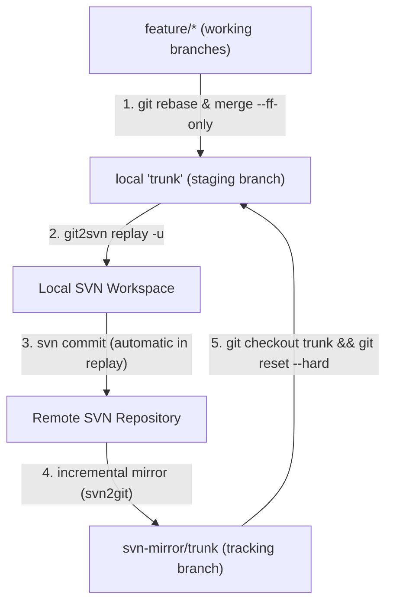

# Cross-Cutting Concepts

This document details the cross-cutting architectural concepts implemented across `git2svn`.

---

## 1. Line Ending Mechanics

Subversion enforces strict line-ending consistency per file. If a file has mixed line endings (`\r\n` and `\n`), Subversion aborts commit operations with:
```text
svn: E135000: Inconsistent line ending style
```

### Normalization Pipeline:
1. **Unified Diff Baseline:** Git produces unified diffs with `\n` line endings.
2. **Context Matching:** `git apply --ignore-whitespace` matches hunks cleanly regardless of whether the target file uses `CRLF` or `LF`.
3. **Hunk Insertion:** When inserting new lines into a `CRLF` file, `git apply` inserts Git's native `LF` characters, creating mixed newlines.
4. **Post-Patch Normalization:**
   - Prior to patching, `git2svn` detects the predominant line ending of the existing SVN file (`detect_file_eol`).
   - After patching, `normalize_file_eol` scans touched text files and rewrites all line endings to match the detected style.
   - Binary files and symlinks are detected and skipped.

---

## 2. Conflict Artifact Management

When a patch fails during multi-commit `replay`:

1. **Failure Containment:**
   - Previous commits remain safely committed in SVN.
   - State (`current_commit`, `remaining_commits`, `git_dir`, `svn_dir`) is saved to `<svn_dir>/.svn/git2svn-replay.json`.
   - `git apply` creates `.rej` files containing the rejected hunks.
2. **Commit Safety Gate:**
   - `git2svn replay --continue` inspects the SVN workspace for leftover `*.rej` and `*.orig` files.
   - If any reject artifacts are found, resumption is blocked to prevent accidental commit of conflict artifacts to the SVN repository.
3. **Cleanup:**
   - `replay --abort` invokes `svn revert -R .`, deletes conflict artifacts, and clears `.svn/git2svn-replay.json`.

---

## 3. Integration Branch Pattern (Inbound / Outbound Mirror Synchronization)

When using `git2svn` alongside an incremental SVN-to-Git mirror (such as `all-fast-export` or `svn2git`):



### Key Principles:
* **Strict Linearity:** The local `trunk` staging branch must remain linear (no merge commits) so each commit can be mapped to an atomic SVN revision.
* **No Rebase Conflicts Upstream:** Git's `patch-id` algorithm recognizes that replayed commits arriving via the inbound mirror match local changes, allowing `git reset --hard svn-mirror/trunk` to advance the local branch without conflicts or duplicate commits.
