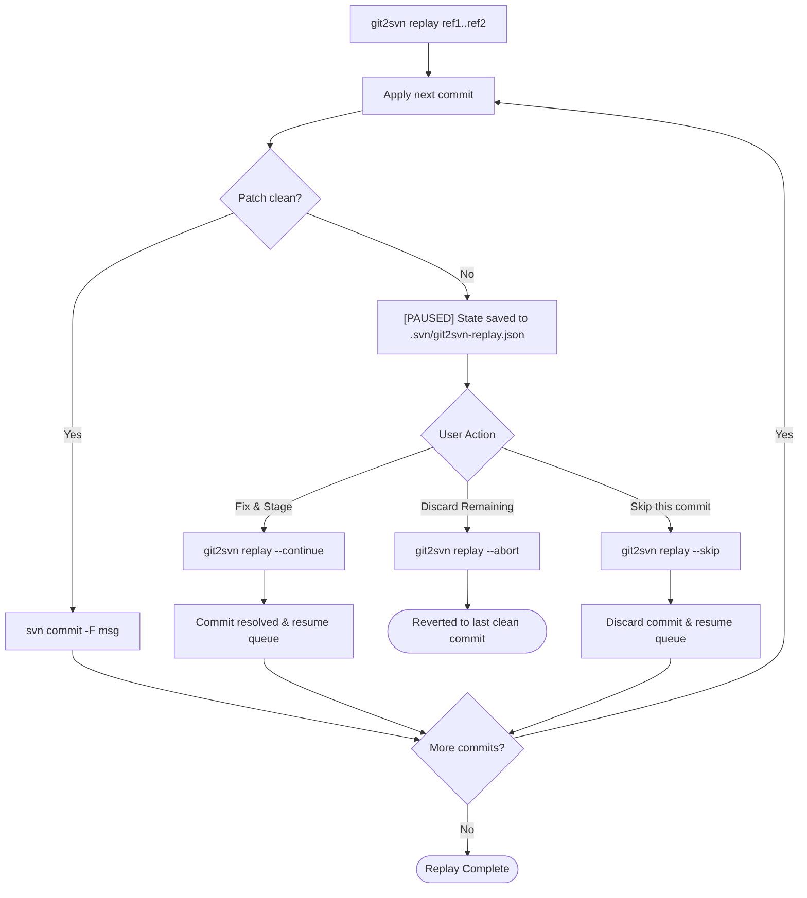

# User Guide: `git2svn` CLI Commands & Workflows

This document provides a comprehensive command-line reference and user guide for `git2svn`.

---

## 1. Global Options & Environment

All options can be specified either before or after subcommands:

```bash
git2svn [-g/--git-dir <path>] [-s/--svn-dir <path>] [-n/--dry-run] [-v/--verbose] <command>
```

| Option | Flag | Environment Variable | Default | Description |
| :--- | :--- | :--- | :--- | :--- |
| `--svn-dir` | `-s` | `SVN_DIR` | None (required) | Path to the local Subversion working copy (`.svn` root). |
| `--git-dir` | `-g` | — | Current Git root | Path to the local Git repository root. |
| `--dry-run` | `-n` | — | `False` | Print actions (file copies, patches, SVN commands) without modifying disk. |
| `--verbose` | `-v` | — | `False` | Print detailed debug logs and execution traces. |

---

## 2. Command: `stage`

Prepares changes in the SVN workspace **without committing**. This leaves the working copy dirty, ready for code review in TortoiseSVN, `svn diff`, or standard manual commit workflows.

### 2.1 Single Commit
Port changes from a single Git revision:
```bash
git2svn stage a1b2c3d4 -s /path/to/svn
```

### 2.2 Range (Squash)
Squash an entire branch or commit series into a single uncommitted SVN changeset. Both dot-notation and two positional arguments are supported:

```bash
# Using dot notation:
git2svn stage main..feature/login -s /path/to/svn

# Using two arguments:
git2svn stage main feature/login -s /path/to/svn
```

### 2.3 Direct Object Extraction (`--copy`)
Bypasses diff generation and `git apply`, instead extracting exact file bytes directly from Git's object database (`git show <ref>:<path>`). Recommended for binary assets, images, or large refactors:

```bash
git2svn stage main..feature/assets --copy -s /path/to/svn
```

### 2.4 Full Tree Alignment (`--snapshot`)
Compares the full tree of a target Git branch or commit against the SVN workspace without needing to know where it branched off from in Git history:
* Identifies and stages deletions (`svn rm`) for files missing in Git.
* Identifies and stages additions (`svn add --parents`) for files new in Git.
* Updates modified files to match Git content, preserving SVN line-ending conventions.

```bash
git2svn stage feature/login --snapshot -s /path/to/svn
```

---

## 3. Command: `replay`

Sequentially ports Git commits onto the SVN workspace, creating an **atomic `svn commit` for each** with its original Git commit message, author body, and timestamps.

> [!IMPORTANT]
> `replay` requires a linear Git history (fast-forward only). If a range contains merge commits, rebase your Git branch first (`git rebase main`).

### 3.1 Single Commit (Cherry-pick)
Replay a single Git commit and immediately commit it to SVN:
```bash
git2svn replay a1b2c3d4 -s /path/to/svn
```

### 3.2 Range Replay
Replay each commit in the range sequentially into SVN history:
```bash
git2svn replay main..feature/login -s /path/to/svn
```

---

## 4. Conflict Resolution Lifecycle

When a patch conflict occurs during a multi-commit `replay`:



### Resolution Steps:
1. **Execution Pauses:** All previous commits remain committed. Replay state is persisted in `<svn_dir>/.svn/git2svn-replay.json`.
2. **Resolve Conflicts:**
   - Inspect `.rej` files in the SVN workspace.
   - Edit files to resolve conflicts.
   - Run `svn add` / `svn rm` if files were added or removed.
   - Delete leftover `*.rej` and `*.orig` files.
3. **Resume Replay:**
   ```bash
   git2svn replay --continue
   ```
   *This automatically commits the resolved changeset using the original Git commit message and proceeds with the rest of the queue.*

### Alternative Actions:
* **Abort:** Discards uncommitted changes and resets the SVN working copy to the last clean revision:
  ```bash
  git2svn replay --abort
  ```
* **Skip:** Discards the failed commit entirely and continues with the next commit in the queue:
  ```bash
  git2svn replay --skip
  ```

---

## 5. Structural Staging Mechanics

During patch application or file copying, `git2svn` maps Git status codes (`git diff --name-status`) to the corresponding Subversion commands:

| Git Status | Description | SVN Action Executed |
| :--- | :--- | :--- |
| **`A`** | Added file | Creates parent directories, runs `svn add <filepath> --parents` |
| **`D`** | Deleted file | Runs `svn rm <filepath>` |
| **`M`** | Modified file | Contents updated via `patch` or direct copy (no SVN structural command needed) |
| **`R`** | Renamed file (`R100 old new`) | Runs `svn rm <old>` followed by `svn add <new> --parents` |
| **`C`** | Copied file (`C100 src dst`) | Runs `svn add <new> --parents` |

---

## 6. Troubleshooting & FAQ

### Q: Why does `replay` fail with "SVN workspace has uncommitted changes"?
`replay` requires a clean SVN workspace so every Git commit is ported as an isolated, atomic Subversion revision. Before running `replay`, review and commit or revert uncommitted changes in your SVN working copy:
```bash
svn status
svn revert -R .
```

### Q: Why does `replay` reject my branch with a "merge commit" error?
`replay` ports changes commit-by-commit to maintain a clean linear SVN history. If your Git branch has merge commits, rebase it first against your target branch:
```bash
git checkout feature/login
git rebase main
```
Alternatively, if you want to squash the entire branch into a single uncommitted SVN changeset without rebasing, use `stage`:
```bash
git2svn stage main..feature/login -s /path/to/svn
```

### Q: How do I handle patch rejections (`.rej` files)?
If `git apply` encounters conflicting context lines, it writes `.rej` files into the SVN working copy and pauses.
1. Open the `.rej` file to see the rejected hunk.
2. Manually make the necessary edits in the target file.
3. Delete the `.rej` (and any `.orig`) file.
4. Run `git2svn replay --continue`.

### Q: Subversion error on Windows: `svn: command not found`
If using TortoiseSVN, ensure the **"command line client tools"** feature was selected during installation. If not, re-run the TortoiseSVN installer, choose **Modify**, and enable the command-line tools component. `git2svn` will also automatically discover `svn.exe` in `C:\Program Files\TortoiseSVN\bin\svn.exe` or `C:\Program Files\SlikSvn\bin\svn.exe`.
