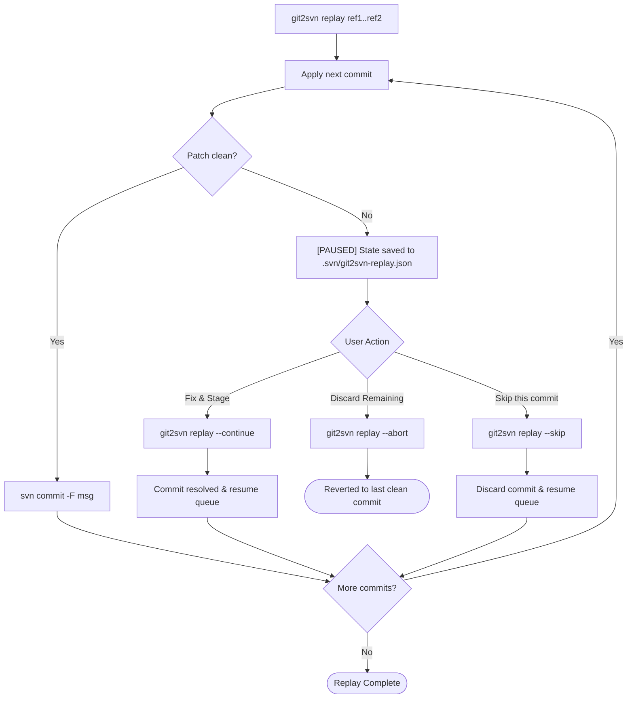

# Command Reference: `stage` & `replay`

This document details the usage, flags, and mechanics for `git2svn stage` and `git2svn replay`.

---

## 1. Command: `stage`

Prepares changes in the SVN workspace **without committing**. This leaves the working copy dirty, ready for code review in TortoiseSVN, `svn diff`, or standard manual commit workflows.

### 1.1 Single Commit
Port changes from a single Git revision:
```bash
git2svn stage a1b2c3d4 -s /path/to/svn
```

### 1.2 Range (Squash)
Squash an entire branch or commit series into a single uncommitted SVN changeset. Both dot-notation and two positional arguments are supported:

```bash
# Using dot notation:
git2svn stage main..feature/login -s /path/to/svn

# Using two arguments:
git2svn stage main feature/login -s /path/to/svn
```

### 1.3 Direct Object Extraction (`--copy`)
Bypasses diff generation and `git apply`, instead extracting exact file bytes directly from Git's object database (`git show <ref>:<path>`). Recommended for binary assets, images, or large refactors:

```bash
git2svn stage main..feature/assets --copy -s /path/to/svn
```

### 1.4 Full Tree Alignment (`--snapshot`)
Compares the full tree of a target Git branch or commit against the SVN workspace without needing to know where it branched off from in Git history:
* Identifies and stages deletions (`svn rm`) for files missing in Git.
* Identifies and stages additions (`svn add --parents`) for files new in Git.
* Updates modified files to match Git content, preserving SVN line-ending conventions.

```bash
git2svn stage feature/login --snapshot -s /path/to/svn
```

---

## 2. Command: `replay`

Sequentially ports Git commits onto the SVN workspace, creating an **atomic `svn commit` for each** with its original Git commit message, author body, and timestamps.

> [!IMPORTANT]
> `replay` requires a linear Git history (fast-forward only). If a range contains merge commits, rebase your Git branch first (`git rebase main`).

### 2.1 Single Commit (Cherry-pick)
Replay a single Git commit and immediately commit it to SVN:
```bash
git2svn replay a1b2c3d4 -s /path/to/svn
```

### 2.2 Range Replay
Replay each commit in the range sequentially into SVN history:
```bash
git2svn replay main..feature/login -s /path/to/svn
```

### 2.3 Updating Working Copy Base Revision (`--update` / `-u`)
Subversion working copies operate with **mixed revisions**: when `git2svn replay` commits revisions to the SVN repository, only touched files are updated locally while the working copy base revision remains pegged at the previous revision (meaning `svn log` won't show new commits without `svn update`).

Use `-u` or `--update` to automatically run `svn update` upon successful replay completion:
```bash
git2svn replay -u main..feature/login -s /path/to/svn
```

You can also enable this permanently for your repository in `.git/config`:
```bash
git config git2svn.autoUpdate true
```

---

## 3. Conflict Resolution Lifecycle

When a patch conflict occurs during a multi-commit `replay`:



### Resolution Steps:
1. **Execution Pauses:** All previous commits remain committed. Replay state is persisted in `<svn_dir>/.svn/git2svn-replay.json`.
2. **Resolve Conflicts:**
   - Inspect `.rej` files in the SVN workspace.
   - Edit files to resolve conflicts.
   - Run `svn add` / `svn rm` if files were added or removed.
   - Delete leftover `*.rej` and `*.orig` files.
3. **Resume Replay:**
   ```bash
   git2svn replay --continue
   ```
   *This automatically commits the resolved changeset using the original Git commit message and proceeds with the rest of the queue.*

### Alternative Actions:
* **Abort:** Discards uncommitted changes and resets the SVN working copy to the last clean revision:
  ```bash
  git2svn replay --abort
  ```
* **Skip:** Discards the failed commit entirely and continues with the next commit in the queue:
  ```bash
  git2svn replay --skip
  ```

---

## 4. Structural Staging Mechanics

During patch application or file copying, `git2svn` maps Git status codes (`git diff --name-status`) to the corresponding Subversion commands:

| Git Status | Description | SVN Action Executed |
| :--- | :--- | :--- |
| **`A`** | Added file | Creates parent directories, runs `svn add <filepath> --parents` |
| **`D`** | Deleted file | Runs `svn rm <filepath>` |
| **`M`** | Modified file | Contents updated via `patch` or direct copy (no SVN structural command needed) |
| **`R`** | Renamed file (`R100 old new`) | Runs `svn rm <old>` followed by `svn add <new> --parents` |
| **`C`** | Copied file (`C100 src dst`) | Runs `svn add <new> --parents` |
