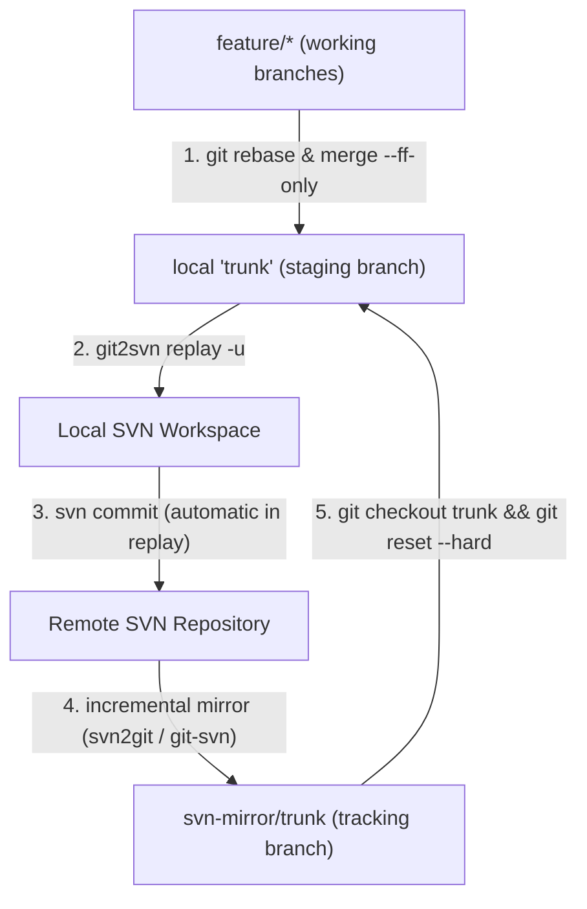
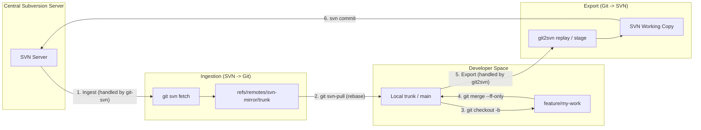

# Recommended Workflow: Git Integration Branch Model

When using `git2svn` alongside an incremental SVN-to-Git mirror (such as `all-fast-export` or `svn2git`), the **Integration Branch Model** provides full Git freedom during development while keeping interactions with SVN completely deterministic, linear, and clean.



---

## 0. Bootstrapping Your Mirror: Two Approaches

Depending on your organization's infrastructure, you can set up your mirror in one of two ways:

### Approach A: Server-Side Mirror (DevOps / SubGit / all-fast-export)
If your team already maintains a centralized GitLab/GitHub mirror that automatically syncs from Subversion, you can clone and configure the repository in a single command using `git2svn clone`:
```bash
git2svn clone git@gitlab.com:mirrors/my-project.git my-project \
    --svn-url https://svn.example.com/repo/my-project/trunk \
    --origin-url git@github.com:my-org/my-project.git
cd my-project
```
This automatically clones the mirror using `--origin svn-mirror`, runs `git2svn setup`, and adds your team's development repository as `origin`.

*(Alternatively, you can manually run `git clone git@github.com:my-org/my-project.git && cd my-project && git2svn setup https://svn.example.com/repo/my-project/trunk`).*

### Approach B: Local Mirror via `git2svn init-mirror` (No DevOps Server Required)
If you do not have a server-side mirror daemon, you can bootstrap a turnkey local mirror directly from Subversion using official `git-svn`:
```bash
git2svn init-mirror https://svn.example.com/repo/my-project my-project --stdlayout
cd my-project
```
This single command:
1. Runs `git svn init` and `git svn fetch` to establish a local tracking mirror at `refs/remotes/svn-mirror/trunk`.
2. Checks out local `trunk`.
3. Sets up the managed local SVN working copy (`.git/git2svn/svn_wc`).
4. Configures `git svn-pull` and `git svn-push` aliases directly hooked into `git svn fetch`.

---

## 0.1 `git2svn` vs. Native `git svn dcommit`: Why Pair Them Together?

A natural question when using `git-svn` as a mirror is: *Why not just use `git svn dcommit` to send changes back to SVN?*

While `git svn fetch` is the gold standard for **ingesting** SVN history into Git (`SVN -> Git`), using `git svn dcommit` for **exporting** (`Git -> SVN`) introduces severe friction in modern development workflows:

| Characteristic | Native `git svn dcommit` | `git2svn` (`replay` / `stage`) |
| :--- | :--- | :--- |
| **Commit Hash Integrity** | **Destructive**: Rewrites the SHA-1 commit hashes of your local Git branch to inject `git-svn-id:` footers. Breaks cherry-picks and pushes to remote Git branches. | **Non-Destructive**: Reads Git commits and ports changes into an SVN working copy. Your Git history and commit SHAs remain completely untouched. |
| **Staging & Manual Review** | **Impossible**: Commits immediately and permanently to SVN. No way to inspect uncommitted changes in TortoiseSVN or run local pre-commit hooks. | **Supported via `git2svn stage`**: Leaves the SVN working copy uncommitted for manual inspection, diff reviews, or squash commits. |
| **Squash & Range Support** | Can only commit all pending linear commits individually. | Supports single commits, explicit ranges (`main..feature`), and squashing (`stage <range>`). |
| **Conflict Handling** | Leaves Git in a confusing detached rebase state if a conflict occurs during commit. | **Stateful**: `replay` pauses at the exact failing commit, creates `.rej` files, and provides `--continue`, `--skip`, `--abort`, and `-i` (interactive mode). |
| **Enterprise SVN Client Rules** | Operates via low-level Perl bindings, sometimes bypassing corporate SVN client hooks or auth setups. | Operates through your standard Subversion CLI/TortoiseSVN client, respecting all corporate client configs and credentials. |

### The Division of Labor

`git-svn` and `git2svn` are designed to work together symbiotically:



- **`git-svn`** handles the hard part of **reading Subversion**: revisions, author mappings, and branches/tags mapping.
- **`git2svn`** handles the hard part of **writing to Subversion**: atomic staging, non-destructive replay, line-ending normalization, and conflict resolution.

---

## 1. Branch Roles

1. **`svn-mirror/trunk` (Remote-tracking branch):** Read-only mirror updated incrementally by your SVN-to-Git synchronization tool. Represents official SVN truth.
2. **`trunk` (Local staging / gateway branch):** Local branch tracking your mirror where commits are queued up and verified before shipping to SVN.
3. **`feature/*` (Topic branches):** Where you write code, create intermediate commits, and test.

---

## 2. Step-by-Step Daily Workflow

### 2.1 Start a Feature from Latest SVN
```bash
# Update local trunk to latest mirrored SVN revision
git checkout trunk
git reset --hard svn-mirror/trunk

# Create a topic branch
git checkout -b feature/login-page
```

### 2.2 Develop & Commit Freely in Git
Make as many intermediate commits, amends, or rebases as needed:
```bash
git commit -m "feat: add login form"
git commit -m "test: add unit tests for login"
```

### 2.3 Integrate into Local `trunk` (Preserving Linearity)
Because `git2svn replay` enforces a strictly linear history, **never create merge commits on `trunk`**. Choose either fast-forward or squash:

* **Option A: Fast-Forward Merge (Preserves atomic commits):**
  ```bash
  git checkout feature/login-page
  git rebase trunk
  git checkout trunk
  git merge --ff-only feature/login-page
  ```

* **Option B: Squash Merge (1 feature = 1 SVN revision):**
  ```bash
  git checkout trunk
  git merge --squash feature/login-page
  git commit -m "feat: complete login page implementation"
  ```

### 2.4 Replay Commits to SVN
Replay the uncommitted range from the mirror base to `trunk`:
```bash
git2svn replay svn-mirror/trunk..trunk
```
*(By default, `replay` automatically executes `svn update` upon completion, ensuring your SVN working copy base revision is bumped to `HEAD`.)*

> [!TIP]
> If you have `git2svn.mirrorRemote` configured (done automatically by `git2svn setup`), you can simply run:
> ```bash
> git2svn replay
> ```
> `git2svn` dynamically targets `<mirrorRemote>/<svn-branch>..HEAD` based on your checked-out SVN working copy branch!

### 2.5 Sync Mirror & Clean Up
Fetch updates from the authoritative SVN mirror tracking branch and align local `trunk`:
```bash
# Fetch latest mirrored SVN revisions
git fetch svn-mirror
git checkout trunk

# Fast-forward trunk (or rebase if you have local commits)
git merge --ff-only svn-mirror/trunk || git rebase svn-mirror/trunk

# Safely delete the merged feature branch
git branch -d feature/login-page
```

---

## 3. Productivity Tip: Safe Git Aliases (`git svn-push` & `git svn-pull`)

To make daily operation feel identical to a standard Git workflow, `git2svn setup` configures custom Git aliases designed with safety guards against accidental data loss:

```bash
# 1. git svn-push: Replays trunk to SVN, fetches mirror, and ONLY resets trunk if the tree matches
git config alias.svn-push "!f() { \
    git2svn replay && \
    git fetch svn-mirror && \
    git checkout trunk && \
    if git diff --quiet trunk svn-mirror/trunk; then \
        git reset --hard svn-mirror/trunk; \
    else \
        echo '[git svn-push] Warning: trunk differs from svn-mirror/trunk. Not resetting.' >&2; \
    fi; \
}; f"

# 2. git svn-pull: Fetches mirror, attempts fast-forward, and automatically rebases local commits
git config alias.svn-pull "!f() { \
    git fetch svn-mirror && \
    git checkout trunk && \
    if ! git merge --ff-only svn-mirror/trunk 2>/dev/null; then \
        echo '[git svn-pull] Fast-forward not possible (local commits on trunk). Rebasing onto svn-mirror/trunk...'; \
        git rebase svn-mirror/trunk; \
    fi; \
}; f"

# 3. git svn-status: Inspects sync health, pending commits, and working tree states
git config alias.svn-status "!git2svn status"
```

### Safety Features of These Aliases:
- **Zero Data Loss on Pull:** `git svn-pull` never uses `reset --hard`. If you made commits directly on `trunk`, it preserves and rebases them cleanly on top of the latest SVN commits.
- **Diff Guard on Push:** `git svn-push` checks `git diff --quiet trunk svn-mirror/trunk`. If any uncommitted or un-replayed differences remain between `trunk` and the mirror, it refuses to reset `trunk`.

### Daily Developer Experience:
With these aliases configured alongside `git2svn.mirrorRemote` (set automatically via `git2svn setup`):

```bash
# Check synchronization health, tree states, and pending commits:
git svn-status

# Pull latest SVN state into local Git trunk (fast-forward or rebase):
git svn-pull

# Code on a feature branch, rebase, and fast-forward into trunk:
git checkout trunk
git merge --ff-only feature/login

# Push all trunk commits to SVN and synchronize mirror safely:
git svn-push
```

---

## 4. Linearity Guard (Preventing Accidental Merge Commits)

`git2svn replay` strictly enforces linear histories because Subversion cannot represent multi-parent Git merge graphs.

### Best Practice Configuration:
To prevent Git from ever creating accidental merge commits when pulling:
```bash
# Enforce fast-forward only when pulling
git config pull.ff only
```

### Pre-Commit Guard:
The repository's [`.githooks/pre-commit`](../../.githooks/pre-commit) hook automatically checks whether a commit being created on `trunk` is a merge commit (detecting `.git/MERGE_HEAD`), aborting the commit immediately:
```text
[git2svn pre-commit hook] ERROR: Merge commits are not permitted on 'trunk'.
[git2svn pre-commit hook] git2svn replay requires a strictly linear history.
[git2svn pre-commit hook] Please rebase your feature branch and use fast-forward: 'git merge --ff-only <branch>'
```

---

## 5. Mirror Protection Guard (Preventing Accidental `git push` to Mirror)

In a Git-SVN workflow where a background daemon (like `svn2git`) mirrors SVN commits to Git, running `git push` directly to the mirrored tracking branch (e.g. `origin/trunk` or `svn-mirror/trunk`) causes Git history to diverge from SVN and breaks automated mirror synchronization.

### Automated `pre-push` Hook
`git2svn setup` automatically installs a safety guard into `.git/hooks/pre-push`.

- **Protected Branch:** If you accidentally attempt to push directly to the mirror tracking branch (`trunk`, `main` on the mirror remote), Git immediately aborts the push:
  ```text
  [git2svn pre-push guard] ERROR: Direct push to 'origin/trunk' is blocked!
  [git2svn pre-push guard] This branch is mirrored from SVN. Pushing directly causes svn2git to diverge.
  [git2svn pre-push guard] To publish your changes to SVN, run:
      git svn-push   (or: git2svn replay)
  ```
- **Feature Branches & PRs Allowed:** If your mirror remote is hosted on a platform like GitLab or GitHub where you create Merge Requests / Pull Requests, pushing feature branches (e.g. `git push origin feature/my-work`) or pushing to personal forks is completely unaffected and permitted.


