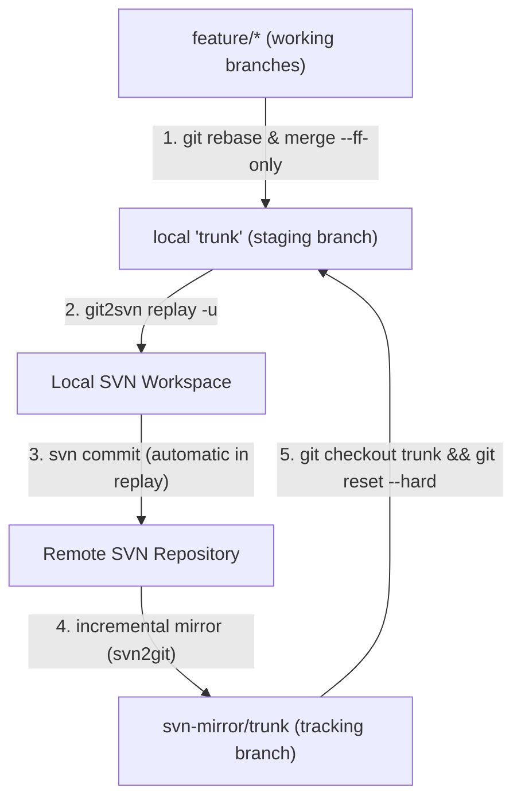

# Recommended Workflow: Git Integration Branch Model

When using `git2svn` alongside an incremental SVN-to-Git mirror (such as `all-fast-export` or `svn2git`), the **Integration Branch Model** provides full Git freedom during development while keeping interactions with SVN completely deterministic, linear, and clean.



---

## 1. Branch Roles

1. **`svn-mirror/trunk` (Remote-tracking branch):** Read-only mirror updated incrementally by your SVN-to-Git synchronization tool. Represents official SVN truth.
2. **`trunk` (Local staging / gateway branch):** Local branch tracking your mirror where commits are queued up and verified before shipping to SVN.
3. **`feature/*` (Topic branches):** Where you write code, create intermediate commits, and test.

---

## 2. Step-by-Step Daily Workflow

### 2.1 Start a Feature from Latest SVN
```bash
# Update local trunk to latest mirrored SVN revision
git checkout trunk
git reset --hard svn-mirror/trunk

# Create a topic branch
git checkout -b feature/login-page
```

### 2.2 Develop & Commit Freely in Git
Make as many intermediate commits, amends, or rebases as needed:
```bash
git commit -m "feat: add login form"
git commit -m "test: add unit tests for login"
```

### 2.3 Integrate into Local `trunk` (Preserving Linearity)
Because `git2svn replay` enforces a strictly linear history, **never create merge commits on `trunk`**. Choose either fast-forward or squash:

* **Option A: Fast-Forward Merge (Preserves atomic commits):**
  ```bash
  git checkout feature/login-page
  git rebase trunk
  git checkout trunk
  git merge --ff-only feature/login-page
  ```

* **Option B: Squash Merge (1 feature = 1 SVN revision):**
  ```bash
  git checkout trunk
  git merge --squash feature/login-page
  git commit -m "feat: complete login page implementation"
  ```

### 2.4 Replay Commits to SVN
Replay the uncommitted range from the mirror base to `trunk`:
```bash
git2svn replay -u svn-mirror/trunk..trunk
```
*(The `-u` flag automatically runs `svn update` upon completion, ensuring your SVN working copy base revision is bumped to `HEAD`.)*

> [!TIP]
> If you configure `git config git2svn.defaultRange "svn-mirror/trunk..trunk"`, you can simply run:
> ```bash
> git2svn replay
> ```
> regardless of what feature branch you currently have checked out, safely and automatically shipping only the commits on `trunk`!

### 2.5 Sync Mirror & Clean Up
Trigger your inbound SVN mirror tool and fast-forward your local `trunk` to match the official upstream history:
```bash
# Run incremental mirror import (e.g. svn2git / all-fast-export)
run-svn2git-sync

# Fetch and reset local trunk to authoritative mirror state
git fetch svn-mirror
git checkout trunk
git reset --hard svn-mirror/trunk

# Safely delete the merged feature branch
git branch -d feature/login-page
```
